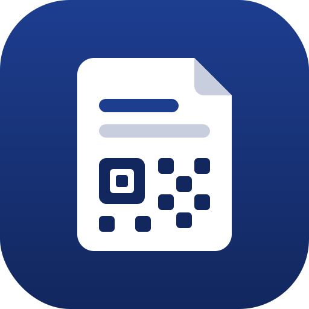

# Erfassungsbogen

Multiplattform-App (Web, Desktop/Electron, Android, iOS) zum Erfassen von
Einheiten-Erfassungsbögen **aller BOS- und sonstigen Organisationen** (THW, Feuerwehr,
Polizei, DRK/JUH/MHD/ASB, DLRG, Bundeswehr, …), Export als druckbares PDF und
Offline-Transport des kompletten Bogens über einen einzelnen QR-Code.

Zwei Anwendungsfälle:

1. **Eigenerfassung** — die Einheit füllt ihren Bogen vollständig selbst aus (THW-Praxis).
2. **Meldekopf-Schnellerfassung** — eine Einheit trifft ohne Bogen ein und wird am
   Meldekopf auf dem Tablet in Minuten erfasst (nur Stärke, Führungskraft, Fahrzeuge),
   der Bogen wird gedruckt und weitergegeben.

## Web-App

Läuft ohne Installation unter **<https://erfassungsbogen.app>** (GitHub Pages,
jeder Push auf `main` deployt automatisch).

Assistent (Einheit → Einsatz → Personal → Fahrzeuge → Sofortbedarf) mit
Gesamtübersicht (alles nachbearbeitbar), PDF-Export im Papier-Layout mit
QR-Code auf der letzten Seite, Bogen speichern/laden als JSON-Datei,
QR-Scannen per Kamera (nativ über Capacitor-Plugin, im Browser/Electron per
Webcam). Alles läuft clientseitig (Codec + pako + qrcode + pdfmake), kein
Server nötig. Code: [index.html](index.html), [src/app/](src/app/).

```
npm install
npm run dev      # Entwicklung: http://localhost:5173
npm run build    # Produktion: dist/ — direkt für GitHub Pages geeignet (base: "./")
```

## Desktop-App (Electron)

Für die Offline-Nutzung ohne Browser gibt es die App als Desktop-Anwendung —
fertige Pakete zum Herunterladen unter
[Releases](https://github.com/wattnpapa/erfassungsbogen/releases/latest):

- **macOS**: `.dmg` (unsigniert — beim ersten Start Rechtsklick → „Öffnen")
- **Windows**: NSIS-Installer (`.exe`)
- **Linux**: `.deb` (Debian/Ubuntu) und `.pacman` (Arch)

Die App prüft beim Start automatisch auf neue Versionen (electron-updater gegen
das neueste GitHub-Release), lädt Updates im Hintergrund und installiert sie
nach Bestätigung bzw. beim nächsten Beenden. Offline-Starts bleiben ungestört.
Auf macOS setzt das Installieren von Updates eine signierte App voraus
(Signierung/Notarisierung aktiviert sich im Workflow automatisch, sobald die
Apple-Secrets wie bei S1-Control hinterlegt sind).

Jeder Push auf `main` baut automatisch ein Release mit Datums-Version
([release.yml](.github/workflows/release.yml), Aufbau wie bei
[S1-Control](https://github.com/wattnpapa/S1-Control)). Lokal:

```
npm run electron:dev     # Entwicklung: Vite-Dev-Server im Electron-Fenster
npm run electron:build   # Paket für die eigene Plattform → release/
```

Der Hauptprozess ([electron/main.js](electron/main.js)) lädt die unveränderte
Web-App aus `dist/` — kein Node-Zugriff im Renderer, externe Links öffnen im
System-Browser.

## Mobile Apps (Android & iOS)

Beide Apps entstehen per [Capacitor](https://capacitorjs.com) aus derselben
Web-App ([android/](android/), [ios/](ios/)) und sind plattformgerecht
gestylt: iOS nach Apple HIG (Dark Mode, Dynamic Type, 44pt-Touch-Ziele),
Android nach Material Design 3 (Farbrollen, Type Scale, 48dp-Touch-Ziele).

- **Android**: signierte APK liegt jedem [Release](https://github.com/wattnpapa/erfassungsbogen/releases/latest) bei (minSdk 26 / Android 8.0).
- **iOS**: Build über Xcode (`npm run ios:sync && npm run ios:open`);
  App-Store-/TestFlight-Einreichung ist in Vorbereitung ([docs/TODO.md](docs/TODO.md)).

Die QR-Codes enthalten `https://erfassungsbogen.app/#<Payload>` — als
Universal/App Link öffnet der Scan mit der Systemkamera direkt die installierte
App, ohne App die Web-App. Datenschutzerklärung für die Stores:
[public/datenschutz.html](public/datenschutz.html).

## Datenmodell & QR-Codec (Schema v3)

- [docs/datenmodell.md](docs/datenmodell.md) — Datenmodell und Binärformat „EEB2"
- [src/model.ts](src/model.ts) — plattformneutrale TypeScript-Typen
- [src/codec.ts](src/codec.ts) — Encoder und Decoder (plattformneutral, Kompression injizierbar)
- [src/qr-node.ts](src/qr-node.ts) — QR-Erzeugung als SVG/PNG für Node/Electron
- [src/vokabulare/thw.ts](src/vokabulare/thw.ts) — THW-Vokabular (StAN Stand 01.07.2026)
- [scripts/qr-demo.ts](scripts/qr-demo.ts) — End-to-End-Test: Bogen → QR-PNG → jsQR-Scan → Decoder → identisch (`npm run demo`; Ausgabe in `examples/`)

Kern der Kompression: organisationsspezifische Vokabulare mit 1-Byte-Codes und
Freitext-Ausweg, BCD-Telefonnummern, abgeleitete statt gespeicherter Werte
(Stärke, M/W/D), Deflate. Ein voller THW-Bogen (20 Personen, 6 Fahrzeuge)
passt so in einen QR-Code von ca. 4,5 × 4,5 cm (Version 18, ECC M), die
Meldekopf-Schnellerfassung in ca. 2,9 × 2,9 cm.

**Abwärtskompatibilität:** Schemaänderungen sind immer migrierbar — QR-Codes
und JSON-Dateien älterer Schema-Versionen (ab v2) bleiben lesbar.

## Offene Punkte

Siehe [docs/TODO.md](docs/TODO.md) (Gerätetests, App Store Connect,
Deep-Link-Verifizierung) — danach: weitere BOS-Vokabulare, THW-OV-Verzeichnis
vervollständigen.

## Lizenz

[EUPL-1.2](LICENSE) — Europäische Union Public Licence (mit amtlicher deutscher Fassung).
