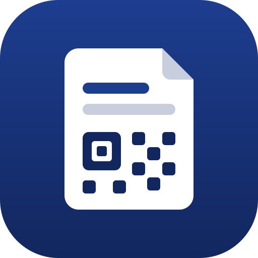

# Erfassungsbogen

Der digitale Einheiten-Erfassungsbogen — ein kostenloses Online-Tool für alle
BOS-Einheiten und Hilfsorganisationen: THW, Feuerwehr, Polizei, DRK/JUH/MHD/ASB,
DLRG, Bundeswehr und den Katastrophenschutz. Die Software für die digitale
Stärkemeldung und Einsatzdokumentation: Bogen am Bildschirm ausfüllen, als PDF
drucken — und der komplette Inhalt steckt zusätzlich in einem einzigen QR-Code,
der ganz ohne Internet auf jedem anderen Gerät wieder eingelesen werden kann
(offline-first, ohne Server).

## Direkt ausprobieren

**<https://erfassungsbogen.app>** — läuft im Browser, ohne Installation und
ohne Anmeldung.

Kurze Einführung und die häufigsten Fragen:
[Anleitung](https://erfassungsbogen.app/anleitung.html).

Eigene Einstiege für die eigene Organisation —
[THW](https://erfassungsbogen.app/thw.html),
[Feuerwehr](https://erfassungsbogen.app/feuerwehr.html),
[DRK](https://erfassungsbogen.app/drk.html),
[Johanniter](https://erfassungsbogen.app/johanniter.html),
[Malteser](https://erfassungsbogen.app/malteser.html),
[ASB](https://erfassungsbogen.app/asb.html),
[DLRG](https://erfassungsbogen.app/dlrg.html) und
[Katastrophenschutz der Länder](https://erfassungsbogen.app/katastrophenschutz.html) —
sowie für Führungsstellen:
[Meldekopf digital](https://erfassungsbogen.app/meldekopf.html).
Wer noch abwägt: [Papier oder digital?](https://erfassungsbogen.app/papier-oder-digital.html)

## Was kann die App?

- **Bogen ausfüllen**: Schritt für Schritt durch Einheit, Einsatz, Personal,
  Fahrzeuge und Sofortbedarf — mit Gesamtübersicht, in der sich alles
  nachbearbeiten lässt.
- **PDF drucken**: im gewohnten Papier-Layout; auf der letzten Seite sitzt ein
  QR-Code, der den kompletten Bogen enthält.
- **QR-Code scannen**: Kamera drauf, und der Bogen ist wieder in der App —
  auch komplett offline, es braucht keinen Server und keine Verbindung
  zwischen den Geräten. Wer den QR-Code mit der normalen Handykamera scannt,
  landet automatisch in der App bzw. auf der Webseite.
- **Von Handy zu Handy**: liegt das andere Gerät daneben, geht der Bogen auch
  per AirDrop (Apple) bzw. Quick Share (Android) hinüber — ohne Netz, ohne
  Kopplung, ohne Kamera. Der Empfänger tippt den Link an und hat den Bogen.
- **Speichern und laden**: der Bogen lässt sich als Datei sichern und
  weitergeben.
- **Als Tabelle für Excel**: ein Bogen — oder ein ganzer Einsatz auf einmal —
  geht als CSV heraus, mit allem, was drinsteht: je eine Zeile für die Einheit,
  für jede Person und für jedes Fahrzeug. Für Verpflegungsabrechnung,
  Personalnachweis oder eigene Auswertungen.
- **Einsätze sammeln (Meldekopf)**: mehrere fremde Bögen unter einem Einsatz
  bündeln — per Scan, aus Datei/PDF, am Tablet manuell erfasst oder direkt aus
  der Übersicht eines gerade geöffneten Bogens („In Einsatz aufnehmen"). Die App
  zählt Stärke und Bedarf über alle anwesenden Einheiten laufend zusammen (mit
  Zwischensummen je Zug), merkt sich tägliche Neumeldungen als Historie und gibt
  alles als Sammel-PDF oder Datei an die nächste Führungsstelle weiter.
- **Für die Schichtübergabe**: meldet eine Einheit neu, zeigt die App, was sich
  gegenüber ihrer letzten Meldung geändert hat — Stärke 12 → 9, Fahrzeug
  abgemeldet, Ruhezeit jetzt nötig. Die Sammel-PDF beginnt mit derselben
  Übersicht, eine Zeile je Einheit.
- **Alles bleibt auf dem Gerät**: keine Anmeldung, kein Server, keine Cloud —
  siehe [Datenschutzerklärung](https://erfassungsbogen.app/datenschutz.html).

## Für wen ist sie gedacht?

1. **Einheiten**, die ihren Erfassungsbogen selbst ausfüllen — statt Papier
   und Handschrift: einmal erfassen, drucken, und beim nächsten Einsatz nur
   noch anpassen.
2. **Meldeköpfe und Bereitstellungsräume**: trifft eine Einheit ohne Bogen
   ein, ist sie am Tablet in wenigen Minuten erfasst (nur Stärke,
   Führungskraft, Fahrzeuge) — Bogen drucken, weitergeben, fertig. Bringt
   die Einheit einen QR-Code mit, reicht ein Scan. Alle eintreffenden Einheiten
   lassen sich unter einem Einsatz sammeln, sodass Stärke und Bedarf jederzeit
   auf einen Blick zusammengezählt sind — ideal auch für Zug- und
   Verbandsführer, die ihre Einheiten bündeln und geschlossen weitermelden.

## Herunterladen

Alle Downloads unter
[Releases](https://github.com/wattnpapa/erfassungsbogen/releases/latest):

| Gerät | Download |
|---|---|
| **Windows** | Installer (`.exe`) — für ARM-Geräte (Snapdragon) die `arm64`-Datei, sonst `x64` |
| **macOS** | `.dmg` (signiert & notarisiert — per Doppelklick startbar) |
| **Linux** | `.deb` (Debian/Ubuntu) oder `.pacman` (Arch) |
| **Android** | APK (Android 8.0 oder neuer) |
| **iPhone/iPad** | App Store / TestFlight in Vorbereitung — bis dahin: <https://erfassungsbogen.app> |

Die Desktop-App funktioniert komplett offline und hält sich selbst aktuell:
Updates werden im Hintergrund geladen und nach Bestätigung installiert.

## Lizenz

Freie Software unter [EUPL-1.2](LICENSE) — Europäische Union Public Licence
(mit amtlicher deutscher Fassung).

## Für Entwickler

Technische Dokumentation (Build, Architektur, Datenformat, QR-Codec):
[docs/entwicklung.md](docs/entwicklung.md)
