# Arc42-Architekturdokumentation — Erfassungsbogen

> **Quelle dieses Dokuments.** Markdown-Fassung von `Arc42-Erfassungsbogen.pdf`
> (Analyse des Repositorys `wattnpapa/erfassungsbogen`, Checkout-Stand
> **2026-09-11**, `main`, inkl. der vier Kern-Submodule unter `vendor/`).
> Die Angaben wurden am 2026-09-12 gegen `main` (Commit `c7604e9`) und den
> angehefteten Submodul-Commit `87b40dd` nachgeprüft; Abweichungen sind als
> *Prüfvermerk* gekennzeichnet. Die zwölf Diagramme des PDF liegen hier wieder
> als Mermaid-Quelltext vor.
>
> **Nach dem Analysestand geändert:** Commit `c7604e9` („Sicherheitsbericht
> umsetzen: SBOM, CSP ohne unsafe-inline, Entpack-Grenze") betrifft die Kapitel
> 2.1, 8.3, 8.6, 8.7 und 11.2 — dort jeweils vermerkt.

---

## Über dieses Dokument

Diese Dokumentation folgt dem arc42-Template und beschreibt das Repository
`wattnpapa/erfassungsbogen` — die Web-/Desktop-/Mobil-App „Erfassungsbogen"
(erreichbar unter <https://erfassungsbogen.app>), den digitalen
Einheiten-Erfassungsbogen für BOS-Einheiten und Hilfsorganisationen.

### Kapitelübersicht

1. Einführung und Ziele
2. Randbedingungen
3. Kontextabgrenzung
4. Lösungsstrategie
5. Bausteinsicht
6. Laufzeitsicht
7. Verteilungssicht
8. Querschnittliche Konzepte
9. Architekturentscheidungen
10. Qualitätsanforderungen
11. Risiken und technische Schulden
12. Glossar

### Wichtigster Vorbehalt

Der UI-freie Kern der Anwendung (`@bos/eeb-format`, `@bos/meldekopf`,
`@bos/vokabulare`, `@bos/taktische-zeichen`) liegt nicht im Hauptrepository,
sondern in vier eigenständigen, öffentlichen GitHub-Repositories, die als
Git-Submodule unter `vendor/` eingebunden sind — diese Dokumentation schließt
sie vollständig mit ein (Kapitel 5.3–5.6 beschreiben ihre innere Struktur,
Kapitel 9 gibt die zugehörige Architekturentscheidung „ADR-003" wörtlich
wieder). Nicht Teil dieser Analyse ist dagegen der Quellcode des
Schwesterprodukts S1-Control selbst, das denselben Kern konsumiert.

---

## 1. Einführung und Ziele

### 1.1 Aufgabenstellung

Der digitale Einheiten-Erfassungsbogen ersetzt den papierenen Erfassungsbogen,
den BOS-Einheiten (Behörden und Organisationen mit Sicherheitsaufgaben) und
Hilfsorganisationen im Einsatz- und Übungsfall führen: THW, Feuerwehr, Polizei,
DRK/Johanniter/Malteser/ASB, DLRG, Bundeswehr und der Katastrophenschutz der
Länder.

Kernfunktionalität (siehe `README.md`):

- **Bogen ausfüllen** – ein Assistent führt durch Einheit, Einsatz, Personal,
  Fahrzeuge und Sofortbedarf; eine Gesamtübersicht erlaubt Nachbearbeitung.
- **PDF-Druck** im gewohnten Papier-Layout der jeweiligen Organisation, mit
  einem QR-Code auf der letzten Seite, der den kompletten Bogeninhalt trägt.
- **Offline-Transport ohne Server**: der QR-Code lässt sich auf jedem anderen
  Gerät wieder einlesen – per Kamera, per USB-Handscanner, per AirDrop/Quick
  Share oder als Datei – ganz ohne Internetverbindung zwischen den Geräten.
- **Einsatz-Sammlung („Meldekopf")**: ein Meldekopf oder eine Führungsstelle
  bündelt die Bögen mehrerer eintreffender Einheiten unter einem Einsatz, zählt
  Stärke und Sofortbedarf laufend zusammen (mit Zwischensummen je Zug), verfolgt
  Schichtübergaben per Diff und gibt alles als Sammel-PDF weiter. Auch
  Fotos/Screenshots von QR-Codes im Stapel und mehrteilige Bögen werden erkannt
  und zusammengeführt. BOS-Nutzer sind Ehrenamtliche und Einsatzkräfte, keine
  IT-Fachleute – die App muss ohne Schulung und ohne Anmeldung funktionieren
  (`PRODUCT.md`).
- **Datenexport** als CSV (Langformat mit allen Feldern) und als Excel-Liste im
  organisationsspezifischen Format „Oldenburg" für Führungsstellen.

Die Anwendung läuft browserbasiert als Progressive Web App
(erfassungsbogen.app), als Desktop-App (Electron: Windows, macOS, Linux) und als
Android-App (Capacitor); eine iOS-App befindet sich in Vorbereitung (TestFlight,
siehe `docs/TODO.md`). Sie ist freie Software unter der EUPL-1.2 (`LICENSE`).

### 1.2 Qualitätsziele

Abgeleitet aus den „Product Principles" in `PRODUCT.md` und aus technischen
Festlegungen im Code (CSP, Bundle-Budget, Schema-Migrationen):

| Rang | Qualitätsziel | Motivation |
| --- | --- | --- |
| 1 | Offlinefähigkeit | „Offline ist der Normalfall, nicht der Fehlerfall" – jede Funktion muss ohne Netz und ohne Server vollständig funktionieren (Service Worker, clientseitige PDF-/QR-Erzeugung, kein Backend). |
| 2 | Bedienbarkeit unter Einsatzbedingungen | Maßgebliche Nutzungssituation ist draußen unterwegs, unter Zeitdruck, bei grellem Tageslicht oder Dunkelheit – Feld- und Nacht-Modus, große Trefferflächen, Kontrast schlagen Ästhetik am Schreibtisch. |
| 3 | Abwärts-/Vorwärtskompatibilität der Daten | Schema-Änderungen (aktuell Version 8) dürfen ältere QR-Codes und Dateien nie unlesbar machen; Encoder schreiben stets die kleinste tragende Schema-Version. |
| 4 | Datenschutz/Vertraulichkeit | Keine Anmeldung, kein Server, keine Cloud – alle Daten bleiben auf dem Gerät; Reichweitenmessung cookielos (GoatCounter); optionale Ed25519-Signatur statt zentraler Identitätsprüfung. |
| 5 | Übereinstimmung mit dem Papierformular | „Das Papier ist der Vertrag" – PDF-Layout und Fachbegriffe folgen den amtlichen Bögen, damit Ausdrucke in bestehende Meldewege passen. |
| 6 | Wartbarkeit/Wiederverwendbarkeit | Der UI-freie Kern ist in eigene Submodul-Repositories ausgelagert und wird mit dem Schwesterprodukt „S1-Control" geteilt (ADR-003); CI-Gates erzwingen genau eine Kopie je Kern-Baustein und ein Bundle-Budget. |
| 7 | Sofortige Nutzbarkeit | Keine Installationspflicht, keine Schulung, ein Scan genügt; QR-Ziel ≤ Version 18 (gut scannbar). |

### 1.3 Stakeholder

| Rolle | Erwartungshaltung |
| --- | --- |
| Einheiten (THW, Feuerwehr, DRK/JUH/MHD/ASB, DLRG, Polizei, Bundeswehr, Katastrophenschutz der Länder) | Füllen ihren eigenen Erfassungsbogen aus, drucken ihn, geben ihn per QR/Datei weiter. Einmal erfassen, beim nächsten Einsatz nur anpassen. |
| Meldeköpfe, Bereitstellungsräume, Führungsstellen (auch Zug-/Verbandsführer) | Erfassen eintreffende fremde Einheiten in Minuten (Schnellerfassung oder QR-Scan), sammeln und summieren Stärke/Sofortbedarf, melden geschlossen weiter. |
| Autor/Maintainer – Johannes Rudolph (`package.json`) | Pflegt Code, Vokabulare, Vorlagen und die vier ausgelagerten Kern-Repositories; trifft Architekturentscheidungen (ADRs im Schwesterprojekt). |
| Schwesterprodukt „S1-Control" | Konsumiert denselben geteilten Kern über dessen gebautes `dist/`; Änderungsanforderungen an den Kern betreffen beide Produkte. |
| Betreiber der Zielplattformen (GitHub Pages, GitHub Releases, Google Play/App Store – zukünftig) | Hosting- bzw. Vertriebsinfrastruktur, ohne eigenes Backend des Projekts. |
| THW-Ortsverbände / Führungsstellen mit Excel-Format „Oldenburg" | Definieren ein festes, nicht verhandelbares Spaltenformat für den Excel-Export der Einheitenliste. |

### 1.4 Hinweis zu dieser Dokumentation

Analysiert wurden das Hauptrepository (Stand `main`, 2026-09-11) und die vier
Kern-Submodule auf ihren angehefteten Commits:

| Submodul | Repository | analysierter Commit |
| --- | --- | --- |
| `vendor/eeb-format` | `wattnpapa/eeb-format` | `87b40dd` (heads/main) |
| `vendor/bos-meldekopf` | `wattnpapa/bos-meldekopf` | `0c433e5` (heads/main) |
| `vendor/bos-vokabulare` | `wattnpapa/bos-vokabulare` | `97ac427` (heads/main) |
| `vendor/bos-taktische-zeichen` | `wattnpapa/bos-taktische-zeichen` | `cb9c227` (heads/main) |

> *Prüfvermerk:* Die vier Commit-Kennungen stimmen mit den Gitlinks auf `main`
> überein (`git ls-tree main vendor/`).

Die Architekturentscheidung ADR-003 („Aufnahmeregeln" für den geteilten Kern)
ist nicht nur im Schwesterprojekt „S1-Control" dokumentiert, sondern liegt —
leicht unterschiedlich formuliert, aber inhaltlich deckungsgleich — auch im
`README.md` jedes der vier Kern-Submodule vor; Kapitel 9 gibt sie vollständig
wieder.

---

## 2. Randbedingungen

### 2.1 Technische Randbedingungen

| Randbedingung | Ausprägung | Quelle |
| --- | --- | --- |
| Programmiersprache | TypeScript (`"type": "module"`, ESM durchgängig) | `package.json`, `tsconfig.json` |
| UI-Framework | React 19 (`react`, `react-dom` ^19.2.7), Function Components + Hooks, kein Router, kein globaler State-Manager (Redux/Zustand/Jotai o. ä. sind nicht eingebunden) | `package.json`, `src/app/app.tsx` |
| Build-Werkzeug | Vite 8 (`vite.config.ts`), Basis-Pfad `"./"` (relative Assets, GitHub-Pages-tauglich) | `vite.config.ts` |
| PWA/Offline | `vite-plugin-pwa` (Workbox), Service Worker cached App-Shell, `registerType: "prompt"` (kein Auto-Reload) | `vite.config.ts` |
| Zielplattformen | Web (PWA), Desktop via Electron (Windows x64/arm64, macOS, Linux), Mobil via Capacitor (Android; iOS in Vorbereitung) | `package.json` (`build`), `electron/main.js`, `capacitor.config.json`, `android/`, `ios/` |
| Geteilter Kern | Vier UI-freie Bibliotheken als Git-Submodule unter `vendor/`, eigene öffentliche Repositories, über `file:`-Abhängigkeiten in `node_modules` eingebunden und von Vite direkt aus der TypeScript-Quelle gebündelt (kein Vorbau nötig) | `.gitmodules`, `docs/entwicklung.md` |
| Kryptografie | Ed25519-Signaturen (`@noble/ed25519`) für Herkunftsnachweis von QR-Codes, ohne zentrale PKI | `docs/datenmodell.md`, `package.json` |
| Datenkompression | `pako` (Deflate) für QR-Payload und Datei-/Sammel-Transport | `package.json` |
| PDF-Erzeugung | `pdfmake`, rein clientseitig, kein Server-Rendering | `package.json`, `src/app/pdf-dokument.ts` |
| QR-Erzeugung/-Decodierung | `qrcode` (Erzeugung), `jsqr` und `zxing-wasm` (Decodierung/Scan, inkl. WebAssembly) | `package.json` |
| XLSX-Export | Eigener minimaler XLSX-Writer (`src/app/xlsx.ts`, ZIP + zwei XML-Teile über `pako`) statt SheetJS/exceljs – bewusste Entscheidung, keine neue Abhängigkeit | `docs/tests.md` |
| Node-Version (CI) | Node 24 | `.github/workflows/ci.yml`, `release.yml` |
| Testwerkzeuge | Vitest (Unit, zwei Projekte `logik`/`oberflaeche`), Cucumber.js + Playwright (E2E/Gherkin auf Deutsch) | `package.json`, `docs/tests.md` |
| Browser-Sicherheit | Content-Security-Policy wird im Build injiziert (`default-src 'self'`, `object-src 'none'`, `base-uri 'none'`, `script-src` ohne `'unsafe-inline'` über `sha256`-Hashes, eng begrenztes `connect-src`/`img-src` nur für GoatCounter) | `vite.config.ts` (`contentSecurityPolicy()`) |
| Software-Lieferkette | SBOM (CycloneDX 1.6) aus den fünf `package-lock.json`, `npm audit` als CI-Gate, Dependabot wöchentlich für npm und GitHub-Actions | `scripts/sbom.ts`, `.github/workflows/ci.yml`, `.github/dependabot.yml` |
| Kamera-Zugriff | Erfordert Secure Context (HTTPS/localhost) für `getUserMedia`; in Electron zusätzliche macOS-Entitlements nötig (`NSCameraUsageDescription`, Hardened-Runtime-Camera-Entitlement) | `docs/TODO.md` |
| Sprache der Oberfläche und des Codes | Durchgängig Deutsch – Bezeichner, Kommentare, Fachbegriffe, Gherkin-Szenarien | `PRODUCT.md`, gesamter Quellcode |

> *Prüfvermerk:* Versionen in `package.json` bestätigt (react ^19.2.7,
> vite ^8.1.4, electron ^43.4.0, typescript ^7.0.2, pako ^3.0.1,
> pdfmake ^0.3.11, @noble/ed25519 ^2.3.0, jsqr ^1.4.0, zxing-wasm ^3.1.3,
> qrcode ^1.5.4); CI-Jobs laufen auf `node-version: 24`.

### 2.2 Organisatorische Randbedingungen

- **Lizenz:** Freie Software unter der EUPL-1.2 (mit amtlicher deutscher
  Fassung) – `LICENSE`.
- **Repository-Struktur:** Der UI-freie Kern liegt in vier eigenständigen,
  öffentlichen GitHub-Repositories (`wattnpapa/eeb-format`,
  `wattnpapa/bos-meldekopf`, `wattnpapa/bos-vokabulare`,
  `wattnpapa/bos-taktische-zeichen`), die als Submodule auf fest gepinnte
  Commits eingebunden sind und nicht automatisch dem `main`-Zweig folgen. Ein
  Versionswechsel ist ein bewusster, separat committeter Schritt
  (`docs/entwicklung.md`).
- **Schwesterprodukt:** Der geteilte Kern wird zusätzlich von „S1-Control v2"
  (Electron-Anwendung mit npm-Workspaces) über dessen gebautes `dist/`
  konsumiert. ADR-003 wurde ursprünglich dort verfasst, liegt aber wörtlich im
  `README.md` jedes Kern-Submoduls vor (Kapitel 9).
- **CI/CD:** Zwei GitHub-Actions-Workflows – `ci.yml` (Prüflauf für Zweige/PRs)
  und `release.yml` (Build & Release bei Push auf `main`, inkl.
  GitHub-Pages-Deployment und plattformspezifischen Build-Jobs). Beide benötigen
  `submodules: recursive` beim Checkout.
- **Versionsschema:** Datumsbasierte Build-Version `YYYY.MMDD.HHMM` (z. B.
  `2026.712.1035`), erzeugt im `prepare`-Job von `release.yml` – gültiges SemVer
  für npm/Electron und gültiger `CFBundleShortVersionString` für iOS,
  minutengenau und monoton steigend.
- **Release-Kanal:** Auslieferung ausschließlich über GitHub Releases, keine
  eigene Update-Infrastruktur; `electron-updater` prüft direkt gegen GitHub.
- **App-Store-Vertrieb** (Android Play Store, iOS App Store/TestFlight) ist laut
  `README.md`/`docs/TODO.md` in Vorbereitung, zum Analysezeitpunkt aber nicht
  produktiv.
- **macOS-Build vorübergehend deaktiviert:** Der `build-mac`-Job in
  `release.yml` ist per `if: false` stillgelegt, weil die Code-Signatur auf dem
  GitHub-Runner scheitert (Kommentar vom 2026-09-05); bis zur Behebung gibt es
  keinen macOS-Download (`README.md`).

### 2.3 Konventionen

- **Deutsche Fachterminologie** ist verbindlich und deckungsgleich mit dem
  Papierformular: Stärke (Schreibweise `x/y/z//g`), Sofortbedarf, Meldekopf,
  Bereitstellungsraum, Funkrufname, taktische Zeichen, Fachgruppe, StAN
  (`PRODUCT.md`).
- **Keine Systemdialoge.** `window.prompt`, `window.confirm` und `window.alert`
  sind projektweit tabu, weil die iOS-App (WKWebView unter Capacitor) sie nicht
  beantwortet. Stattdessen zeichnet die App eigene Dialoge
  (`src/app/dialoge.tsx`); ein E2E-Wachhund (`features/support/haken.ts`) lässt
  jedes Szenario scheitern, in dem doch ein Systemdialog auftaucht.
- **Kein Tailwind, eigene Design-Tokens** (`PRODUCT.md`) – CSS-Design-Token
  statt Utility-Framework, um die „Amtlich"-Optik gezielt zu steuern.
- **Dunkelmodus nur per Schalter**, nie automatisch über `prefers-color-scheme`
  (`PRODUCT.md`), da Feld- und Nacht-Modus fachliche Bedienmodi sind.
- **Modulgenaue Importe** aus den Kern-Submodulen (`@bos/eeb-format/model` statt
  `@bos/eeb-format`), um große Vokabular-Tabellen nicht ins Startbündel zu
  ziehen (`docs/entwicklung.md`).
- **Zwei CI-Wächter** setzen Architekturregeln technisch durch:
  `npm run kern-kopien` (genau eine Kopie jedes Kern-Bausteins im Baum) und
  `npm run bundle-budget` (Bundle-Größe gegen `scripts/bundle-budget.json`).
- **Commit-/Tag-Konvention:** Jeder Release-Build auf `main` erzeugt automatisch
  einen Git-Tag mit der Build-Version.

---

## 3. Kontextabgrenzung

### 3.1 Fachlicher Kontext

Die App hat keinen Server und keine Cloud-Anbindung – jede fachliche Interaktion
findet entweder auf dem Gerät selbst statt oder über einen Offline-Transportweg
(QR-Code, Datei, AirDrop/Quick Share, Papier) zu einem zweiten Gerät.

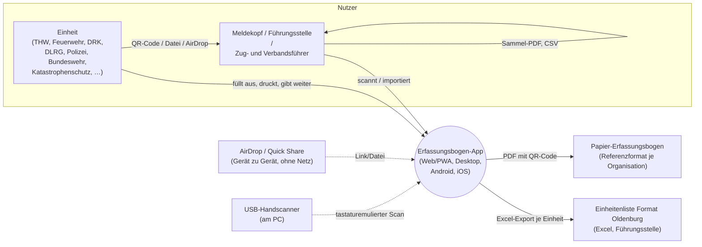

**Kommunikationspartner und Schnittstellen**

| Partner / Nachbarsystem | Art der Schnittstelle | Beschreibung |
| --- | --- | --- |
| Einheit (Erfasser) | Bedienoberfläche (Web/App) | Füllt den Assistenten aus (Einheit, Einsatz, Personal, Fahrzeuge, Sofortbedarf), druckt PDF, gibt Bogen per QR/Datei/AirDrop weiter. |
| Meldekopf/Führungsstelle (Sammler) | Bedienoberfläche + Scan-Eingang | Erfasst fremde Einheiten neu (Schnellerfassung) oder importiert deren Bögen (Kamera-Scan, USB-Handscanner, Foto-Stapel, Datei/PDF); sammelt sie unter einem Einsatz, sieht laufende Summen, gibt Sammel-PDF/CSV weiter. |
| Papier-Erfassungsbogen der Organisation | Referenzformat (kein Datenfluss) | Das PDF-Layout muss dem gewohnten amtlichen Papierbogen entsprechen, damit Ausdrucke in bestehende (nicht-digitale) Meldewege passen. |
| USB-Handscanner | Tastatur-Emulation | Der Scanner „tippt" den dekodierten QR-Inhalt wie eine Tastatur ein; die App entwirrt scancode-bedingte Tastaturbelegungsfehler (`src/app/tastaturbelegung.ts`). |
| AirDrop (Apple) / Quick Share (Android) | Betriebssystem-Nahfeldfreigabe | Reiner Transportkanal für den geteilten Link/die Datei; die App implementiert dafür nichts außer einem teilbaren Link. |
| Excel-Vorlage „Oldenburg" | Exportformat | Fest vorgegebenes, nicht verhandelbares Spaltenformat (38 Spalten, Farben, Datumsformat) einer externen Führungsstelle; die App liefert nur ihre Spalten, der Rest (Ablösung, Zusagen, Schicht) bleibt leer. |
| THW-Ortsverbandsverzeichnis | Eingebettete Referenzdaten (kein Live-Zugriff) | ~700 THW-Ortsverbände mit Nummer/Name/Kontakten sind im Bundle enthalten; ein QR kann statt der ausgeschriebenen Hierarchie nur die Ortsverbandsnummer tragen (`standortRef`). |

### 3.2 Technischer Kontext

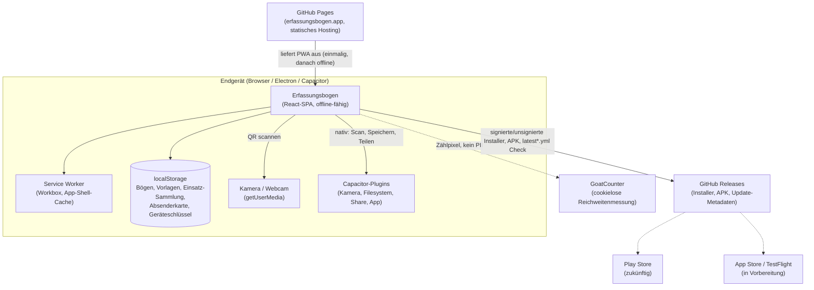

| System | Richtung | Zweck | Protokoll/Format |
| --- | --- | --- | --- |
| GitHub Pages (erfassungsbogen.app) | eingehend (einmaliger Ladevorgang) | Statisches Hosting der PWA; nach dem ersten Laden läuft die App vollständig offline (Service Worker) | HTTPS, statische Dateien aus `dist/` |
| GoatCounter | ausgehend | Cookielose, datensparsame Reichweitenmessung; einziger in der CSP erlaubter externer Host | HTTPS-Zählpixel (`img-src`/`connect-src` in der CSP) |
| GitHub Releases | ein-/ausgehend | Verteilt Desktop-/Android-Installer; `electron-updater` prüft im Hintergrund auf neue Versionen | `latest*.yml`-Metadaten + Binärartefakte, generischer electron-updater-Provider |
| Google Play Store / Apple App Store | ausgehend (geplant) | Zukünftiger Vertriebsweg für Android/iOS; laut `README.md` noch nicht produktiv | – |
| Capacitor-Plugin-Schicht | intern (nativ) | Kapselt native Fähigkeiten (Kamera-Barcode-Scan, Dateisystem, Teilen, App-Lifecycle/Deep-Links) einheitlich für Android/iOS | Capacitor-Bridge (JS ↔ nativer Code) |

Es gibt **kein Backend, keine Datenbank und keine Nutzerkonten** – eine
bewusste, mehrfach dokumentierte Produktentscheidung („Kein Server, keine
Anmeldung, keine Cloud", `PRODUCT.md`).

---

## 4. Lösungsstrategie

### 4.1 Reines Client-System statt Server-Architektur

Alle fachlichen Prozesse (Bogen ausfüllen, PDF erzeugen, QR kodieren/dekodieren,
Einsatz-Sammlung, Excel-/CSV-Export) laufen vollständig im Client. Es existiert
kein Application- oder Datenbank-Server. Die einzige Infrastruktur ist
statisches Hosting (GitHub Pages) für den initialen Ladevorgang und GitHub
Releases als Downloadquelle für native Installer.

### 4.2 Eine Web-Codebasis, drei native Hüllen

- **Browser/PWA** – direkt unter erfassungsbogen.app, Service Worker für
  Offline-Start.
- **Electron** (`electron/main.js`) – lädt dasselbe gebaute `dist/` als
  Datei-URL, kein Node-Zugriff im Renderer (`contextIsolation: true`,
  `nodeIntegration: false`, `sandbox: true`); native Fähigkeiten werden gezielt
  und minimal freigeschaltet.
- **Capacitor** (Android, iOS in Vorbereitung) – dieselbe Web-App in einer
  WebView; native Fähigkeiten über Capacitor-Plugins (`src/app/nativ.ts`).

Weichenstellungen (`istNativ()`, `imWebBrowser()`) entscheiden zur Laufzeit, ob
der Service Worker registriert wird, ob Systemdialoge vermieden werden müssen
und ob Web-Download- oder natives Share-Sheet-Verhalten greift.

### 4.3 UI-freier Kern als geteiltes, versioniertes Fundament

Datenmodell, Codec, Signatur, Meldekopf-Aggregation, Vokabulare und taktische
Zeichen liegen in vier eigenständigen Bibliotheken als Git-Submodule unter
`vendor/`. Grund ist das zweite Produkt S1-Control, das denselben Codec und
dieselbe Meldekopf-Logik benötigt (ADR-003). Zwei CI-Prüfungen (`kern-kopien`,
`bundle-budget`) verhindern Architekturverfall.

### 4.4 Datensparsamkeit als Architekturtreiber

Weil der einzige Offline-Transportweg ein QR-Code ist, bestimmt dessen begrenzte
Kapazität weite Teile der Datenmodellierung: kontrolliertes Vokabular statt
Freitext, organisationsspezifische 1-Byte-Codes, Varint-Kodierung,
Deflate-Kompression und eine alphanumerisch-optimierte Base41-Transportkodierung
(Kapitel 8.5, `docs/datenmodell.md`).

### 4.5 Schema-Evolution statt Breaking Changes

Das Datenformat hat Schema-Version 8 erreicht (v1 THW-spezifisch bis v8 mehrere
Fahrerlaubnisklassen je Person). Jede App-Version kann Schema `2..SCHEMA_VERSION`
lesen und migriert beim Laden automatisch; beim Schreiben wird stets die
kleinste tragende Version gewählt (`transportSchemaVersion`).

### 4.6 Sicherheitsmodell ohne zentrale Instanz

Dezentrales, TOFU-artiges Vertrauensmodell: jedes Gerät erzeugt lokal ein
Ed25519-Schlüsselpaar; signierte QR-Codes belegen, dass ein Datensatz unverändert
von genau diesem Schlüssel stammt – nicht, wem der Schlüssel gehört. Eine
Signaturkette („Gegenzeichnen") macht den Meldeweg über mehrere Stellen
nachvollziehbar.

### 4.7 Testautomatisierung entlang der Risikoverteilung

Plattformneutrale Logik (Codec, Datenmodell, Migration) wird mit schnellen
Vitest-Unit-Tests abgesichert, inklusive eingefrorener Golden-Fixtures für alte
Schema-Versionen. Beobachtbares Nutzerverhalten wird mit Cucumber/Playwright
gegen den produktiven Build getestet. Native Gerätetests sind als teuerste Stufe
bewusst zurückgestellt (`docs/tests.md`, Ausbaustufe 3).

### 4.8 Generierte statt handgepflegte Artefakte

`sitemap.xml` (Datum aus der Git-Historie), die Kopfnavigation der ~35
statischen Seiten (aus `src/app/kopfnav.ts`), die Content-Security-Policy sowie
das Inline-Font-CSS entstehen im Build. Leitmotiv laut Code-Kommentar: „von Hand
gepflegt wäre es nach dem nächsten Release falsch, und ein falsches Datum ist
schlechter als keines."

---

## 5. Bausteinsicht

### 5.1 Whitebox Gesamtsystem (Level 1)

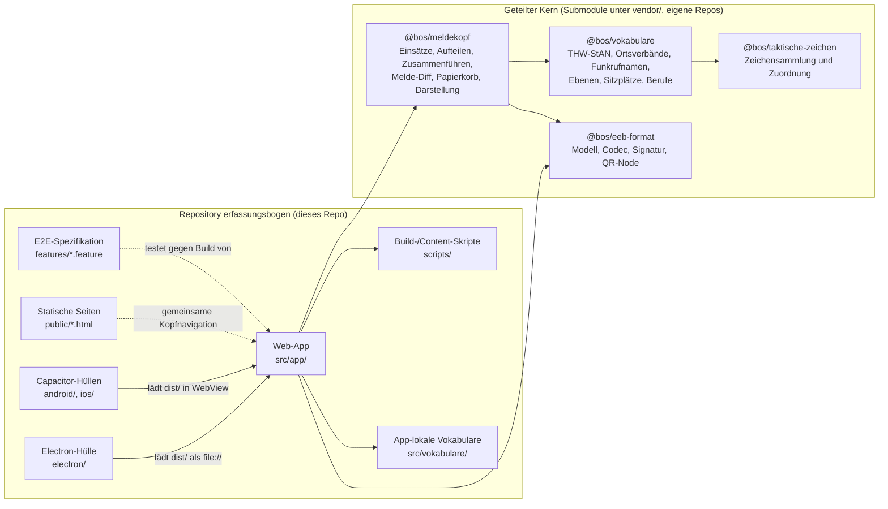

| Baustein | Verantwortung |
| --- | --- |
| Web-App (`src/app/`) | React-Oberfläche, Assistent, Meldekopf-UI, PDF-/CSV-/XLSX-Export-Aufrufe, Plattform-Anpassung, lokale Persistenz. |
| Statische Seiten (`public/*.html`) | ~35 SEO-/Informationsseiten je Organisation (THW, Feuerwehr, DRK, …), Anleitung, Datenschutz, Impressum – teilen sich Kopfnavigation und Design-Token mit der App, laufen aber außerhalb des React-Bundles. |
| Electron-Hülle (`electron/main.js`) | Desktop-Fenster, Auto-Update (`electron-updater`), eingeschränkte Berechtigungsvergabe, externe Links im Systembrowser öffnen. |
| Capacitor-Hüllen (`android/`, `ios/`) | Native Projekte (Gradle/Xcode), binden Capacitor-Plugins (Kamera-Barcode-Scanner, Filesystem, Share, App) ein. |
| Build-/Content-Skripte (`scripts/`) | Vite-Plugin-Hilfsfunktionen, Beispielbogen-Generatoren je Bundesland/Organisation, Icon-/Screenshot-Rendering, Sitemap, Kopfnavigation, Bundle-Budget-Prüfung, Kern-Kopien-Prüfung. |
| E2E-Spezifikation (`features/`) | Gherkin-Szenarien auf Deutsch als ausführbare Anforderungsdokumentation und Regressionsschutz. |
| App-lokale Vokabulare (`src/vokabulare/`) | Inhalte, die laut `docs/entwicklung.md` bewusst nicht in den Kern gewandert sind, z. B. Landesvorlagen (`import.meta.glob`, eine Vite-Eigenschaft). |
| `@bos/eeb-format` | Datenmodell (`model.ts`, 446 Zeilen), Binär-/QR-Codec (`codec.ts`, 1043 Zeilen — größtes Modul im Kern), Ed25519-Signatur (`signatur.ts`, 340 Zeilen), QR-Erzeugung außerhalb des Browsers (`qr-node.ts`). |
| `@bos/meldekopf` | Reine Logik der Einsatz-Sammlung (`einsaetze.ts`, 752 Zeilen), Aufteilen/Zusammenführen, Melde-Diff (`meldung-diff.ts`, 346 Zeilen), Papierkorb, Text-Darstellung – bekommt die Speicher-Ablage von außen hineingereicht. |
| `@bos/vokabulare` | Große, organisationsspezifische Nachschlagetabellen: `berufe.ts` (3531 Zeilen), `thw-ov-regionalstruktur.ts` (784) und `thw-ov.ts` (695), `thw.ts`, `thw-funkrufnamen.ts`, `ebenen.ts`, `sitzplaetze.ts`, `dlrg-qualifikationen.ts`. Bewusst modulgenau importierbar. |
| `@bos/taktische-zeichen` | Zuordnungslogik (`zeichen.ts`, 428 Zeilen, dreistufige Auflösung) auf einer wöchentlich automatisch aktualisierten, extern bezogenen Zeichensammlung (`symbole.ts`, 765 Zeilen); kennt den Erfassungsbogen selbst nicht. |

> *Prüfvermerk:* Zeilenzahlen für `@bos/eeb-format` im angehefteten Commit
> `87b40dd` bestätigt (`model.ts` 446, `codec.ts` 1043, `signatur.ts` 340,
> `qr-node.ts` 50, `index.ts` 89). Die Zahlen der übrigen drei Submodule konnten
> im vorliegenden Checkout nicht nachgeprüft werden (nicht ausgecheckt).

Alle vier Repositories tragen ein nahezu identisches, im jeweiligen `README.md`
dokumentiertes Regelwerk **„Aufnahmeregeln (ADR-003)"** mit sechs Regeln sowie
einen dokumentierten **Rückweg**: Blockiert der geteilte Kern zweimal in drei
Monaten ein Release des Schwesterprodukts, wird der jeweilige Stand als Kopie
übernommen und beide Seiten getrennt weitergepflegt (Kapitel 9).

### 5.2 Whitebox „Web-App" (Level 2)

Einstieg ist `src/app/main.tsx` (Plattform-Setup, Wurzelknoten), die eigentliche
Anwendung steht in `src/app/app.tsx` (State-Haltung über React-`useState`,
Hash-Fragment-Routing für QR-/Link-Einstiege, kein Router-Framework).

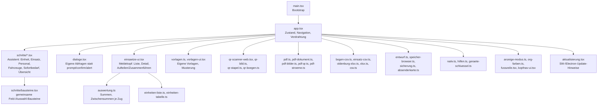

| Untermodul | Aufgabe |
| --- | --- |
| `schritte/` | Ein Schritt des Erfassungs-Assistenten je Datei (`einheit.tsx`, `einsatz.tsx`, `personal.tsx`, `fahrzeuge.tsx`, `sofortbedarf.tsx`, `uebersicht.tsx`); gemeinsame UI-Bausteine in `bausteine.tsx`. |
| `dialoge.tsx` | Ersatz für Systemdialoge: `frageText`/`frageFelder` (statt `prompt`), `frageJaNein` (statt `confirm`), `frageWahl`, `zeigeHinweis` (statt `alert`); gezeichnet von einer einmal eingehängten `<Dialogschicht />`. |
| `einsaetze-ui.tsx` (56 KB, größte UI-Datei) | Einsatz-Sammlung: Liste, Detailsicht mit Summen, Abrücken, Zug-Etikett, Aufteilen/Zusammenführen, Folgemeldung/Historie/Diff, Sammel-PDF, CSV-Export, Papierkorb. |
| `qr-scanner-web.tsx` + `qr-bild.ts`/`qr-stapel.ts`/`qr-boegen.ts` | Web-QR-Scan per `getUserMedia`/jsQR, Einzelbild-Decodierung, Stapel-Import (mehrere Fotos/Screenshots, Mehrteil-Erkennung), Gruppierung von QR-Texten zu vollständigen Bögen. |
| `pdf-dokument.ts` (833 Zeilen, größte Nicht-UI-Datei) | Baut die pdfmake-Dokumentdefinition im Papier-Layout inkl. eingebettetem QR-Code auf der letzten Seite. |
| `pdf-bilder.ts` / `pdf-qr.ts` / `pdf-stroeme.ts` | Rückfallebene: PDF-Bild-Objekte roh als Pixel lesen und den enthaltenen QR-Code decodieren – bewusst ohne vollständigen PDF-Renderer. |
| `bogen-csv.ts` / `einsatz-csv.ts` / `oldenburg-xlsx.ts` / `xlsx.ts` / `csv.ts` | Datenexporte: vollständiges CSV je Bogen/Einsatz (Langformat mit Satzart-Spalte), CSV-Übersicht für die Lagekarte, XLSX im „Oldenburg"-Format, gemeinsame CSV-Formatgrundlagen (Semikolon, UTF-8-BOM, Dezimalkomma). |
| `entwurf.ts` / `speicher-browser.ts` / `sicherung.ts` / `absenderkarte.ts` | Lokale Persistenz: Entwurfswiederherstellung, `localStorage`-Anbindung der Einsatz-Sammlung, Datensicherung/-Export, freiwillige Absenderkarte. |
| `nativ.ts` / `hilfen.ts` / `geraete-schluessel.ts` | Abstraktion nativer Fähigkeiten über Capacitor; Anzeige-/Migrations-Helfer (`bogenLaden`, `migriereBogen`, `einheitAnzeigename`); Erzeugung/Verwaltung des geräteeigenen Ed25519-Schlüssels. |
| `anzeige-modus.ts` / `org-farben.ts` | Dunkel-/Feld-/Nacht-Modus als Design-Token-Umschaltung; organisationsspezifische Akzentfarben. |
| `aktualisierung.tsx` | Update-Hinweise: Service-Worker-Banner im Web, Electron-Auto-Update-Status im Desktop. |

### 5.3 Whitebox „@bos/eeb-format" (Level 2)

`@bos/eeb-format` ist mit 3724 Zeilen (Produktivcode + Tests) das größte und am
striktesten abgeschottete der vier Kern-Module. Es hat zwei Einstiegspunkte:

```ts
import { SCHEMA_VERSION, encodePayloadUrl } from "@bos/eeb-format";      // plattformneutral
import { bogenZuQrSvg, nodeKompressor } from "@bos/eeb-format/node";     // nur Node/Electron
```

| Modul | Verantwortung |
| --- | --- |
| `model.ts` (446 Zeilen) | Typdefinitionen (`Erfassungsbogen`, `Einheit`, `Person`, `Fahrzeug`, `Sofortbedarf`, `HierarchieEbene`, …), Enums (`OrganisationsTyp`, `StaerkeRolle`, `Fahrerlaubnis`, `Geschlecht`, `Ernaehrung`, `PersonalErfassung`), abgeleitete Werte (`staerke()`, `unterbringungMWD()`, `verpflegung()`, `ansprechpartner()`), Datums-/Zeitkonvertierung (`EebDatum`, `EebZeitpunkt`, Referenzepoche 2020-01-01), `SCHEMA_VERSION = 8`, `transportSchemaVersion()`, `migriereBogen()`. Importiert laut Kopfkommentar bewusst nichts. |
| `codec.ts` (1043 Zeilen) | Binärkodierung/-dekodierung, Base41-Transportkodierung, QR-Payload-Aufbau (`EEB2`/`EEB2C`), Segmentierung großer Bögen. Die Kompression wird als `Kompressor`-Funktion hineingereicht (Browser: pako, Node: `node:zlib`). |
| `signatur.ts` (340 Zeilen) | Ed25519-Signatur/-Verifikation, Signaturkette („Gegenzeichnen", `gegengezeichnetePayloadBytes`), Container-Format `EEB2C`, Absenderkarten-Kodierung. |
| `qr-node.ts` (50 Zeilen) | QR-Erzeugung außerhalb des Browsers (SVG/PNG), z. B. für die Beispielbogen-Generatorskripte. Einziges Modul, das `node:zlib`, `qrcode` und `Buffer` benutzen darf. |
| `index.ts` (89 Zeilen) | Öffentliche Fassade: reexportiert `model`/`codec`/`signatur` (nicht `qr-node`), definiert `kernVersion()` sowie eine handgeschriebene UTF-8-Kodierfunktion, die bewusst ohne `TextEncoder` auskommt. |

Architektonische Besonderheiten, die die Trennung technisch erzwingen:

- `tsconfig.json` lässt `"DOM"` bewusst aus `lib` weg und setzt `"types": []` —
  schon `document`, `window` oder `Buffer` lässt die Typprüfung scheitern.
  `qr-node.ts` ist per eigenem `tsconfig.node.json` ausgenommen.
- `eslint.config.mjs` verbietet per `no-restricted-imports` alle `node:`-Module,
  Electron, Capacitor, React und DOM-nahe Pakete außerhalb von `qr-node.ts`
  sowie jeden Rückimport aus `@s1/*` oder der Erfassungsbogen-App.
- `vitest.config.ts` fährt dieselben Testdateien in zwei Projekten — einmal
  unter `node`, einmal unter `jsdom` — als laufender Beweis der
  Plattformneutralität.
- Konsumiert wird das gebaute `dist/` (`tsc -p tsconfig.build.json`), nicht
  `src/` direkt: ein direkter Export auf `./src/index.ts` funktioniert nur,
  solange der `file:`-Pfad ein Symlink ist, und scheitert sonst mit
  `ERR_UNSUPPORTED_NODE_MODULES_TYPE_STRIPPING`. Der Erfassungsbogen umgeht das,
  indem Vite `@bos/*` per Alias direkt auf `vendor/*/src/*.ts` abbildet.
- Es gibt bewusst **kein** `prepare`-Skript (siehe ADR-003a).

### 5.4 Whitebox „@bos/meldekopf" (Level 2)

`@bos/meldekopf` (3167 Zeilen) implementiert die Einsatz-Sammlung als reine,
speicherunabhängige Logik:

| Modul | Verantwortung |
| --- | --- |
| `einsaetze.ts` (752 Zeilen) | Die Sammlung selbst: Einsatz anlegen (`einsatzAnlegen`), Revisionen je Einheit stapeln, Zuordnung per inhaltsbasiertem Fingerabdruck/Dedupe, Idempotenz über Inhalts-Hash. |
| `aufteilen.ts` / `zusammenfuehren.ts` | Eine Meldung in zwei zählende Einheiten trennen (ohne Stärke zu verlieren) bzw. die Gegenrichtung. |
| `meldung-diff.ts` (346 Zeilen) | Was sich zwischen zwei Fassungen einer Meldung geändert hat (Grundlage der Schichtübergabe-Anzeige). |
| `papierkorb.ts` | Wiederherstellbarkeit für 30 Tage, danach endgültiges Löschen. |
| `darstellung.ts` | Bogeninhalte als Text, wie sie auf dem Papierbogen stehen — plattformneutrale Vorstufe für PDF/CSV-Ausgabe. |

Die Ablage wird **hineingereicht, nicht selbst geholt** (Aufnahmeregel 2 aus
ADR-003):

```ts
import { speicherhuelleSetzen, einsatzAnlegen, EinsatzArt } from "@bos/meldekopf";

speicherhuelleSetzen(localStorage);   // Erfassungsbogen ruft das in src/app/speicher-browser.ts auf
einsatzAnlegen("Hochwasser Hunte", EinsatzArt.EINSATZ, "Oldenburg");
```

Ohne diesen Aufruf arbeitet die Sammlung speicherlos (Listen bleiben leer,
Schreibvorgänge verpuffen) — bewusst dasselbe Verhalten wie bei blockiertem
Browser-Speicher (Privatmodus), kein Absturz.

`@bos/eeb-format` und `@bos/vokabulare` sind `peerDependency`, nicht
`dependency`: läge das Format ein zweites Mal im Abhängigkeitsbaum, sähe
TypeScript zwei verschiedene Typen namens „Bogen" (das „Diamant-Problem" aus
ADR-003). Eine dokumentierte Ausnahme betrifft `src/plattform.d.ts`:
`crypto.randomUUID()` wird optional deklariert; fehlt es zur Laufzeit, fällt die
Sammlung auf Zeitstempel + Zufallszahl zurück.

### 5.5 Whitebox „@bos/vokabulare" (Level 2)

`@bos/vokabulare` (6737 Zeilen, der datenreichste Kern-Baustein) liefert reine
Nachschlagetabellen plus Zugriffsfunktionen, keine Geschäftslogik:

| Modul | Inhalt |
| --- | --- |
| `berufe.ts` (3531 Zeilen) | 3512 Berufsbezeichnungen der Bundesagentur für Arbeit. |
| `thw-ov-regionalstruktur.ts` (784) / `thw-ov.ts` (695) | THW-Ortsverbände, Geschäftsstellen, Landesverbände (Basis für `standortRef`). |
| `thw.ts` (289) | StAN-Vokabulare: Einheitstypen, Funktionen, Fahrzeugtypen, Funkruf-Kennwörter. |
| `thw-funkrufnamen.ts` (227) | Kennwörter und Teile des Funkrufnamens. |
| `thw-funktionen-ergaenzung.ts` (164) | Funktionen jenseits der StAN-Taschenkarte. |
| `thw-stan-personal.ts` (138) / `thw-stan-fahrzeuge.ts` (122) | Sollausstattung je Teileinheit. |
| `sitzplaetze.ts` (110) | Sitzplätze je Fahrzeugtyp, Bilanz gegen die Stärke. |
| `dlrg-qualifikationen.ts` (112) | Ausbildungskennzahlen der DLRG. |
| `ebenen.ts` (73) | Hierarchie-Ebenen je Organisation (THW OV→RB→LV, FW Gemeinde→LK→Bezirk→Land, …). |

Bewusst **nicht** in diesem Baustein: `landesvorlagen.ts` (bleibt im
Erfassungsbogen, weil es `import.meta.glob` nutzt und die Beispielbögen
Produktinhalt statt Vokabular sind) sowie die Zeichen-Symboldaten.

### 5.6 Whitebox „@bos/taktische-zeichen" (Level 2)

`@bos/taktische-zeichen` (1409 Zeilen) löst taktische Zeichen nach DV 102 auf
und kennt das Bogenmodell dabei nicht:

```ts
import { fahrzeugZeichenSvg, einheitZeichenSvg } from "@bos/taktische-zeichen";

fahrzeugZeichenSvg({ organisation: "thw", kurz: "GKW", name: "Gerätekraftwagen" });
```

Entgegengenommen werden nur Organisation (eigener Schlüssel: `thw`, `feuerwehr`,
`polizei`, `bundeswehr`, `hilfsorganisation`, `wasserrettung`, `sonstige`),
Kurzzeichen, Name und optional ein Vokabular-Code — kein `Einheit`-,
`Fahrzeug`- oder `OrganisationsTyp`-Typ. Das Auflösen aus einem konkreten
Erfassungsbogen übernimmt das Produkt (`src/app/taktische-zeichen-bogen.ts`).

| Modul | Verantwortung |
| --- | --- |
| `zeichen.ts` (428 Zeilen) | Dreistufige Zuordnung: (1) bekannter Vokabular-Code (aktuell nur THW) → fest zugeordnetes Zeichen, (2) Namenssuche über Dateiname/Titel — zuerst organisationsintern, dann neutrale Grundzeichen, (3) kein Treffer → Grundzeichen (Kfz/Anhänger/Boot/Formation) in Organisationsfarbe mit Kurzzeichen beschriftet. |
| `symbole.ts` (765 Zeilen, generiert) | Die eigentlichen SVG-Zeichen, bezogen aus der externen Sammlung `jonas-koeritz/Taktische-Zeichen` (CC BY 4.0), bearbeitet durch `scripts/holen.mts` (entfernt eingebettete Schrift: ~26 KB → ~800 B je Datei, korrigiert `viewbox`→`viewBox`, setzt einen von pdfmake registrierten Font). |

**Automatische Aktualisierung, aber ohne automatische Übernahme:** Ein eigener
Workflow (`.github/workflows/sammlung-aktualisieren.yml` im Submodul) prüft
wöchentlich montags 04:00 UTC, ob die externe Zeichensammlung ein neues Release
hat, erzeugt `symbole.ts` bei Bedarf neu und committet nach `main` — aber nur,
wenn Typecheck, Lint und die Zuordnungstabellen-Tests grün sind. Ob die Produkte
diesem Stand folgen, entscheidet der Submodul-Commit-Pin (ADR-003, Regel 6).

**Lizenzlage:** Code EUPL-1.2, Zeichen in `src/symbole.ts` CC BY 4.0
(© Jonas Köritz) — bei Weitergabe ist die Namensnennung mitzuführen. Das
Upstream-README merkt an, dass die Sammlung vor Februar 2021 anders lizenziert
war und ältere Angaben (z. B. „CC0") geprüft werden sollten.

### 5.7 Zuordnung Anforderung → Baustein

| Anforderung/Feature (Kapitel 1) | Primär verantwortliche Bausteine |
| --- | --- |
| Bogen ausfüllen (Assistent) | `src/app/schritte/*`, `@bos/eeb-format/model` |
| PDF drucken mit QR | `pdf-dokument.ts`, `@bos/eeb-format/codec` |
| QR/Foto/USB-Scanner einlesen | `qr-scanner-web.tsx`, `qr-stapel.ts`, `qr-boegen.ts`, `tastaturbelegung.ts` |
| Einsatz-Sammlung/Meldekopf | `einsaetze-ui.tsx`, `@bos/meldekopf/*`, `auswertung.ts` |
| CSV-/Excel-Export | `bogen-csv.ts`, `einsatz-csv.ts`, `oldenburg-xlsx.ts` |
| Vorlagen & Musterung | `vorlagen.ts`, `vorlagen-ui.tsx` |
| Signatur/Herkunft | `@bos/eeb-format/signatur`, `absenderkarte.ts`, `geraete-schluessel.ts` |
| Offline-Betrieb (PWA) | `vite.config.ts` (VitePWA), `aktualisierung.tsx` |
| Desktop-Auto-Update | `electron/main.js`, `electron-updater` |

---

## 6. Laufzeitsicht

### 6.1 Bogen ausfüllen und als PDF/QR weitergeben

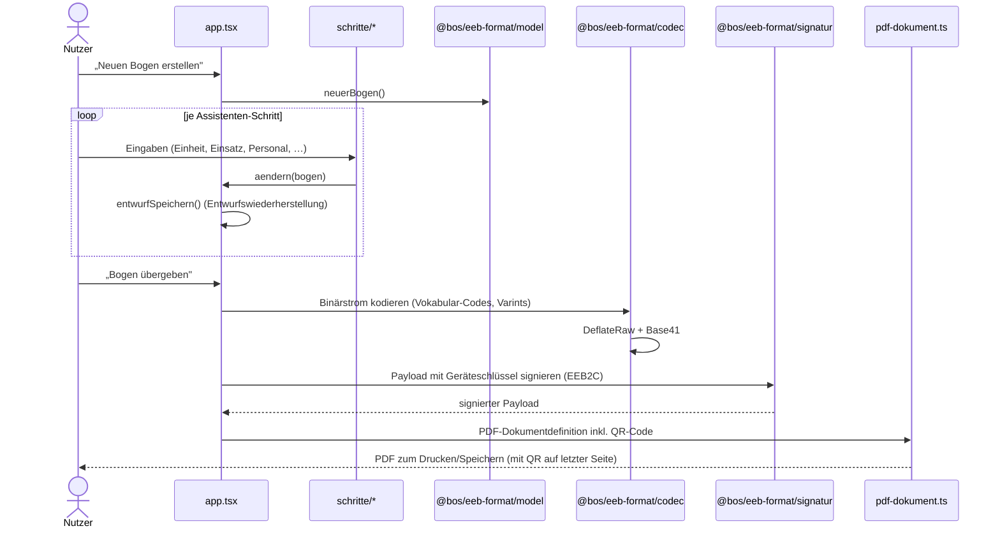

Zusätzlich verzweigt die App bei zu großem Bogen automatisch in die
Segmentierung (Kapitel 8.5): überschreitet der Payload das Zielbudget
(≤ QR-Version 18), erzeugt `codec.ts` mehrere `EEBS.`-QR-Codes statt eines
einzelnen `EEB2`/`EEB2C`-Codes.

### 6.2 QR-Code einlesen (inkl. Schema-Migration)

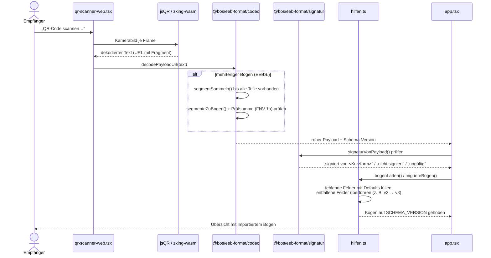

Wichtige Eigenschaften:

- Die Verifikation **blockiert den Import nie** – ein ungültig signierter oder
  unsignierter Bogen wird trotzdem geladen, nur der Vertrauenshinweis ändert
  sich (`docs/datenmodell.md`).
- Migration ist verlustfrei nach vorn: jede Version `2..SCHEMA_VERSION` wird
  akzeptiert; ein eingefrorener v2-Payload dient als Regressionstest
  (`vendor/eeb-format/src/codec.migration.test.ts`).
- Bei Scan über einen USB-Handscanner entfällt der Kamera-Schritt;
  `entwirreScanText` in `src/app/tastaturbelegung.ts` korrigiert layoutbedingte
  Fehlinterpretationen, bevor `decodePayloadUrl` aufgerufen wird.

### 6.3 Meldekopf: fremden Bogen in die Einsatz-Sammlung aufnehmen

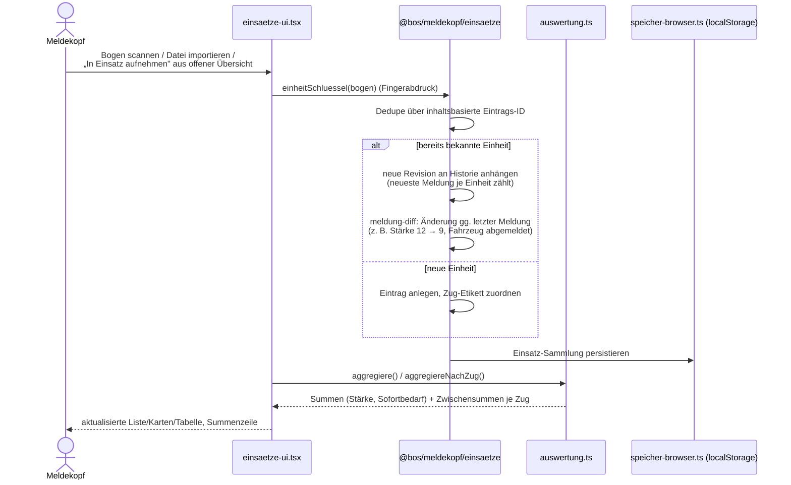

Beim Stapel-Import vieler QR-Fotos (`qr-stapel.ts`) läuft dieselbe Aufnahme-Logik
pro erkanntem Bogen, jedoch sequenziell (nicht parallel, um nicht n entpackte
Bitmaps gleichzeitig im Speicher zu halten) und ohne Rückfrage je Bogen –
gleicher Inhalt wird übersprungen, neuer Inhalt derselben Einheit landet als
neue Fassung in der Historie; am Ende steht ein Bericht (Funde, Dateien ohne
Bogen, unvollständige Mehrteil-Sätze).

### 6.4 Offline-Start der Web-App (Service Worker)

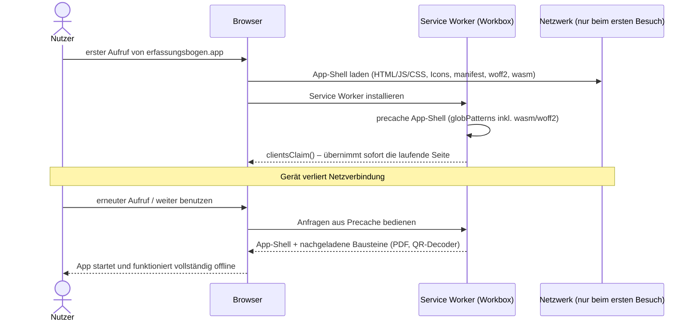

`clientsClaim: true` schließt eine dokumentierte Lücke: ohne diese Option bliebe
der erste Besuch am frisch installierten Service Worker vorbei am Netz hängen –
nachgeladene Bausteine (PDF-Satz, QR-Decoder, Landesvorlagen) kämen beim ersten
Klick aus dem Netz, und ein Funkloch direkt nach dem ersten Aufruf hätte „error
loading dynamically imported module" zur Folge (`docs/entwicklung.md`,
abgesichert durch das Szenario „Die PDF entsteht auch ohne Netz und ohne
Neuladen" in `features/uebergabe.feature`).

### 6.5 Desktop-Auto-Update (Electron)

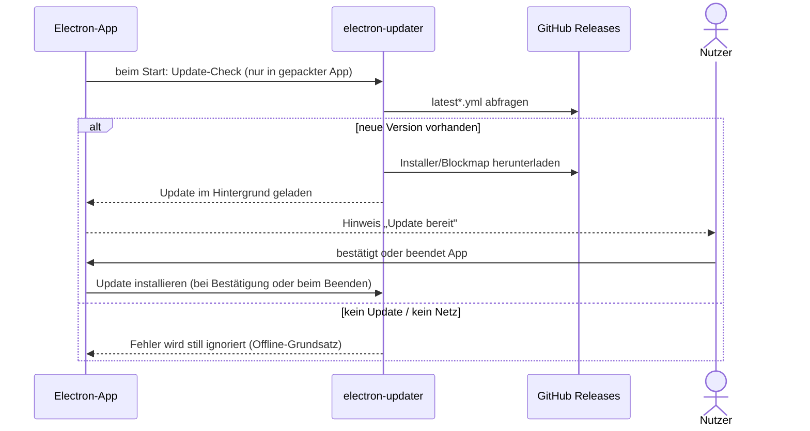

---

## 7. Verteilungssicht

Es gibt keine eigene Server-Infrastruktur. „Verteilung" bedeutet hier: wie
gelangt der gebaute Code auf die Endgeräte, und wie läuft die CI/CD-Pipeline
dorthin.

### 7.1 Infrastruktur Ebene 1: Build- und Distributionskette

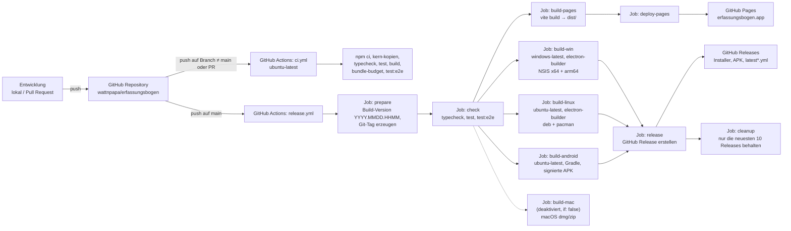

### 7.2 Infrastruktur Ebene 2: Auslieferung an Endgeräte

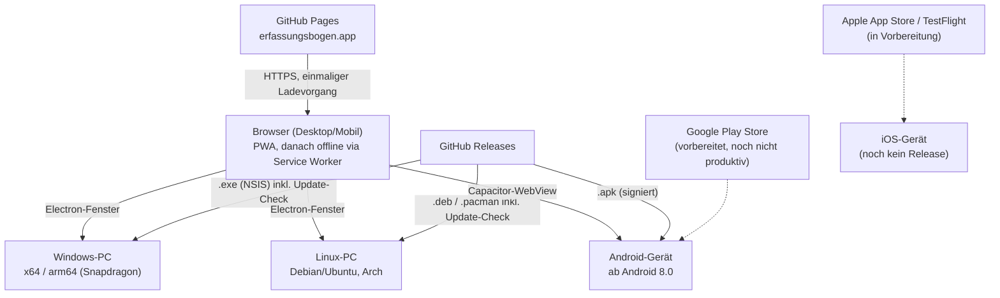

### 7.3 Zielplattformen im Detail

| Plattform | Technologie | Artefakt | Verteilweg | Auto-Update |
| --- | --- | --- | --- | --- |
| Web/PWA | Vite-Build, Service Worker (Workbox) | `dist/` (statische Dateien) | GitHub Pages (erfassungsbogen.app), Deployment bei jedem Push auf `main` | Service-Worker-Update-Banner, kein Auto-Reload |
| Windows | Electron + electron-builder, NSIS | `.exe` (x64 und separat arm64, je eigener Installer) | GitHub Releases | electron-updater, Hintergrund-Download, Installation nach Bestätigung oder beim Beenden |
| Linux | Electron + electron-builder | `.deb` (Debian/Ubuntu), `.pacman` (Arch) | GitHub Releases | electron-updater |
| macOS | Electron + electron-builder | `.dmg`, `.zip` | Vorübergehend deaktiviert (Signatur scheitert auf dem CI-Runner, Stand 2026-09-05); bis dahin Verweis auf die Web-App | – |
| Android | Capacitor + Gradle | signierte `.apk` (Release-Keystore aus GitHub Secret) | GitHub Releases; Play Store vorbereitet, noch nicht produktiv | kein In-App-Updater dokumentiert; manueller Download neuer APK |
| iOS | Capacitor + Xcode | – | App Store/TestFlight in Vorbereitung (`docs/TODO.md`); bis dahin Verweis auf die Web-App | – |

### 7.4 Besonderheiten der Pipeline

- **Concurrency-Schutz gegen doppelte Deployments:** `release.yml` gruppiert nach
  `${{ github.workflow }}-${{ github.sha }}` – ein doppelt ausgelöster Lauf für
  denselben Commit bricht sich selbst ab, weil GitHub Pages pro Commit nur ein
  Deployment führt.
- `ci.yml` läuft für Zweige/PRs (nicht `main`) und prüft dieselben Gates wie
  `release.yml`, inklusive der beiden ADR-003-Wächter `kern-kopien` und
  `bundle-budget`.
- **Vollständige Git-Historie nur beim Pages-Build** (`fetch-depth: 0`), weil die
  generierte `sitemap.xml` ihr `<lastmod>` je Seite aus dem letzten ändernden
  Commit liest; ein flacher Checkout ließe das Skript das Datum bewusst weglassen
  statt ein falsches zu erfinden.
- **Windows-Build erzeugt zwei Architekturen in Folge** (zuerst arm64, dann x64),
  weil beide dieselbe `latest.yml` schreiben und die Metadaten am Ende auf das
  x64-Paket zeigen sollen; ARM64 ist kein Nebenschauplatz, da die emulierte
  x64-App auf Snapdragon-Geräten nicht an die Kamera kommt.
- **Release-Aufräumung:** Ein `cleanup`-Job löscht nach jedem erfolgreichen
  Release alte GitHub-Releases/Tags, außer den neuesten 10 (`KEEP: 10`).
- Alle Submodul-Checkouts erfolgen mit `submodules: recursive`, da bereits die
  Typprüfung ohne den geteilten Kern scheitert.

---

## 8. Querschnittliche Konzepte

### 8.1 UI-Konzept

- **Eigenes Design-Token-System statt Utility-Framework.** Bewusster Verzicht auf
  Tailwind (`PRODUCT.md`), um die „Amtlich"-Optik über eigene CSS-Custom-Properties
  zu steuern.
- **Oberflächenschrift Archivo**, als Variable Font aus dem Bundle geladen
  (`@fontsource-variable/archivo`), nicht von einem CDN. Im Produktions-Build wird
  zusätzlich nur das Latin-Subset der `@font-face`-Regel als Base64 in die
  `index.html` eingebettet (`fontCssInline()` in `vite.config.ts`), um einen
  LCP-Repaint zu vermeiden.
- **Drei Anzeigemodi:** Dunkel-, Feld- und Nacht-Modus als reine
  Token-Umschaltung (`src/app/anzeige-modus.ts`), nur per Schalter aktivierbar –
  nie automatisch über `prefers-color-scheme`.
- **Keine Systemdialoge.** Eigene Ersatzfunktionen
  `frageText`/`frageFelder`/`frageJaNein`/`frageWahl`/`zeigeHinweis` in
  `src/app/dialoge.tsx`, gezeichnet von einer global eingehängten
  `<Dialogschicht />`; E2E-Wachhund in `features/support/haken.ts`.
- **Barrierefreiheit ohne verbindlichen Standard:** Kein festgelegtes
  BITV/WCAG-Ziel, aber produktspezifisch etablierter hoher Kontrast (Feld-Modus)
  und Nacht-Modus.
- **Organisationsspezifische Akzentfarben** (`org-farben.ts`) und eingebettete
  taktische Zeichen (`taktische-zeichen-bogen.ts`).

### 8.2 Persistenzkonzept

- **Keine Datenbank, kein Server.** Alle Nutzdaten liegen ausschließlich im
  `localStorage` des Geräts (`speicher-browser.ts` als einzige Anbindungsstelle
  zwischen Browser-Speicher und der `@bos/meldekopf`-Kernlogik).
- **Entwurfswiederherstellung** (`entwurf.ts`): ein gerade ausgefüllter, noch
  nicht übergebener Bogen geht bei Neuladen/Absturz nicht verloren.
- **Papierkorb statt endgültigem Löschen** – Prinzip „Nichts geht verloren"
  (`PRODUCT.md`); betrifft Vorlagen und Einträge der Einsatz-Sammlung.
- **Datensicherung/-Export:** expliziter Export/Import als Datei (JSON), sodass
  Nutzer ihre gesamte Einsatz-Sammlung sichern und übertragen können
  (`sicherung.ts`, `einsatz-transport.ts`).
- **Absenderkarte** (`absenderkarte.ts`) und der geräteeigene Signaturschlüssel
  (`geraete-schluessel.ts`) sind ebenfalls nur lokal gespeichert,
  personenbezogen und jederzeit löschbar; sie wandern mit der Datensicherung mit. Der Signaturschlüssel hat dafür einen eigenen Weg neben
  „Alle Daten löschen": „Geräteschlüssel neu erzeugen" in der Fußzeile verwirft
  ihn und legt sofort ein neues Paar an, ohne die Bogendaten anzufassen — der
  technische Teil von Maßnahme M3 des
  [Informationssicherheitskonzepts](informationssicherheitskonzept.md).

### 8.3 Sicherheits- und Datenschutzkonzept

- **Content-Security-Policy** wird ausschließlich im Produktions-Build als
  `<meta>`-Tag injiziert (`contentSecurityPolicy()` in `vite.config.ts`):
  `default-src 'self' file:`, `object-src 'none'`, `base-uri 'none'`,
  `form-action 'none'`; `connect-src`/`img-src` sind auf den eigenen Ursprung
  plus einen einzigen externen Host beschränkt
  (`erfassungsbogen.goatcounter.com`). `script-src` gibt die drei
  Inline-`<script>`-Blöcke der `index.html` einzeln über beim Bauen erzeugte
  `sha256`-Hashes frei und kommt damit **ohne `'unsafe-inline'`** aus;
  `style-src` behält `'unsafe-inline'`, weil React `style`-Attribute an
  Elementen setzt. `file:` deckt den Electron-Build ab.

  > *Prüfvermerk:* Die Hash-Freigabe kam mit `c7604e9` (2026-09-12); die
  > PDF-Fassung vom 2026-09-11 beschreibt noch `'unsafe-inline'` bei
  > `script-src`.

- **Entpack-Grenze beim Import:** Der in den Codec hineingereichte
  `browserKompressor` (`src/app/hilfen.ts`) nutzt `inflateRawBegrenzt` mit
  `MAX_ENTPACKT = 4 MiB` und prüft streamend — eine präparierte Datei kann den
  Speicher nicht mehr vollaufen lassen (ebenfalls `c7604e9`).

- **Software-Lieferkette:** `npm run sbom` (`scripts/sbom.ts`) erzeugt eine
  CycloneDX-1.6-Stückliste aus den fünf `package-lock.json` ohne Installation
  und ohne Netz; `npm audit --omit=dev --audit-level=high` blockiert im CI,
  `npm audit` über das Bau-/Testwerkzeug läuft als Hinweis mit; Dependabot
  (`.github/dependabot.yml`) prüft wöchentlich npm und GitHub-Actions.
- **Keine Anmeldung, keine Cloud**, keine personenbezogenen Daten verlassen das
  Gerät außer über den vom Nutzer selbst gewählten Transportweg.
- **Cookielose Reichweitenmessung** über GoatCounter – der einzige erlaubte
  Fremd-Host in der CSP.
- **Ed25519-Signatur** jedes von der App erzeugten QR-Codes (Container `EEB2C`),
  Geräteschlüssel wird lokal beim ersten Bedarf erzeugt; Verifikation ist rein
  informativ und blockiert den Import nie. Ein Schlüsselwechsel ist jederzeit
  möglich (Fußzeile), wird aber nicht verkündet: Ohne PKI gibt es keinen
  Widerruf, die Gegenstelle gleicht die neue Kurzform von Hand ab.
- **Meldeweg für Schwachstellen:** `SECURITY.md` im Hauptrepository, gültig für
  das Hauptrepo und die vier `vendor/`-Submodule (Private Vulnerability
  Reporting auf GitHub oder E-Mail, keine öffentlichen Issues).
- **TOFU-Vertrauensmodell**, keine zentrale PKI: „✓ signiert von …" belegt nur,
  dass der Datensatz unverändert vom Inhaber dieses Schlüssels stammt – nicht,
  wer diese Person ist.
- **Signaturkette beim Weiterreichen (Gegenzeichnen):** ein unverändert
  weitergereichter Bogen wird um eine zusätzliche Stufe ergänzt statt neu
  signiert (bis zu 32 Stufen, `MAX_STUFEN`).
- **Absenderkarte ist Eigenangabe**, keine Identitätszusicherung.
- **Electron-Härtung:** `contextIsolation: true`, `nodeIntegration: false`,
  `sandbox: true`; nur die Berechtigungen `media` (Kamera) und
  Zwischenablage-Zugriff werden gewährt, alles andere pauschal abgelehnt.

> *Prüfvermerk:* CSP-Direktiven, Electron-Härtung, die Rechte-Whitelist
> (`media`, `clipboard-read`, `clipboard-sanitized-write`) und
> `MAX_STUFEN = 32` im Code bestätigt.

### 8.4 Kompatibilitätskonzept (Schema-Evolution)

- **Schema-Version aktuell 8** (`vendor/eeb-format/src/model.ts`); Historie: v1
  (THW-spezifisch) → v2 (organisationsübergreifend) → v3 (Ernährungsform je
  Person) → v4 (ein Kennzeichen-Feld) → v5 (Einheitsname in der Hierarchie) → v6
  (Übungs-Kennzeichnung) → v7 (stand minutengenau) → v8 (mehrere
  Fahrerlaubnisklassen je Person).
- **Abwärtskompatibilität ist Pflicht:** `decodeBinaer` und
  `bogenLaden`/`migriereBogen` akzeptieren jede Version `2..SCHEMA_VERSION`,
  füllen fehlende Felder mit Defaults, überführen entfallene Felder (Beispiel: v2
  `Sofortbedarf.davonVegetarisch` → `verpflegungManuell`) und heben den Bogen
  anschließend auf die aktuelle Version.
- **Vorwärtskompatibilität über die kleinste tragende Version**
  (`transportSchemaVersion`): Ein Bogen ohne Übungs-Flag bleibt Schema 5 und
  damit für ältere App-Stände lesbar; erst ein Übungsbogen fordert Schema 6 – und
  wird von älteren Versionen dann bewusst mit „nicht unterstützte
  Schema-Version" abgelehnt, statt eine Übung unmarkiert wie einen echten Einsatz
  anzuzeigen.
- **Golden-Fixture-Tests** (`vendor/eeb-format/src/codec.migration.test.ts`,
  `features/fixtures.ts`) frieren einen echten v2-QR-Payload als Konstante ein;
  diese Bytes dürfen sich nie ändern.
- **Bewusste Ausnahme (v4):** das historische THW-Kennzeichen-Sonderformat (Zahl
  statt String) wird beim Decodieren aus QR-Codes nur übersprungen (Feld bleibt
  leer), in JSON-Dateien/Vorlagen dagegen aktiv migriert (84397 → „THW-84397").

### 8.5 Kompressions- und Transportkonzept

- **Namensraumbasierte Vokabulare:** Der `OrganisationsTyp` (1 Byte) wählt einen
  Namensraum, innerhalb dessen Einheitstyp, Funktionen, Fahrzeugtyp,
  Hierarchie-Ebenen und Qualifikationen als 1-Byte-Codes aufgelöst werden; jeder
  Vokabular-Wert hat einen Freitext-Ausweg (`code 0` + String).
- **Bitweise Kodierung häufiger Enums** (Geschlecht, Ernährung, Stärkerolle je 2
  Bit; Fahrerlaubnisklasse 4 Bit), BCD-gepackte Telefonnummern, Datum/Zeit als
  kompakte Ganzzahl seit einem festen Referenzdatum.
- **Pipeline:** Binärstrom → DeflateRaw (pako) → Base41 → alphanumerischer
  QR-Modus. Base41 (41-Zeichen-Alphabet, angelehnt an Base45/RFC 9285, aber
  URL-sicher) nutzt den alphanumerischen QR-Modus (5,5 Bit/Zeichen) statt des
  Byte-Modus (8 Bit/Zeichen) – gemessen über 227 Beispielbögen sinkt die mittlere
  QR-Version von 20,50 auf 17,66.
- **Zwei Formate je nach Zweck:** Der QR-Code nutzt Base41 (`B.`-Marker); der
  teilbare Textlink bleibt bewusst Base64url, weil Base41-Sonderzeichen
  (`$ * / :`) in Chat-Programmen die Link-Erkennung zerstören würden.
- **Segmentierung als Fallback:** Nur wenn ein Bogen das Zielbudget
  (≤ QR-Version 18, Fehlerkorrektur M, ≈512 Payload-Bytes) überschreitet, wird
  der Payload auf mehrere `EEBS.`-QR-Codes (je ≤ Version 13) aufgeteilt; eine
  32-Bit-Prüfsumme (FNV-1a) bindet die Teile aneinander.
- **Gemessene Größen:** voller THW-Bogen 511 Bytes → QR-Version 18 (mit
  Ortsverbands-Referenz: 411 Bytes → Version 15); Meldekopf-Schnellerfassung
  191 Bytes → Version 10.

### 8.6 Testkonzept

- **Zwei Vitest-Projekte** (`vitest.config.ts`): `logik` (Node, `.test.ts`) und
  `oberflaeche` (jsdom + Testing Library, `.test.tsx`, u. a. der komplette
  Assistenten-Durchlauf in `app.test.tsx`).
- **Cucumber.js + Playwright** für Verhaltenstests: Gherkin-Szenarien auf Deutsch
  unter `features/*.feature`, gefahren gegen den produktiven Build
  (`vite preview`), nicht gegen den Dev-Server – weil pdfmake im Dev-Server beim
  Rendern hängt. `EEB_BROWSER=webkit` erlaubt eine Näherung an die
  iOS-WKWebView.
- **Wachhund gegen Systemdialoge und Portprüfung vor Testlauf-Start**
  (Fehlschlag mit Klartext-Meldung, falls Port 5273 belegt ist).
- **Golden-Fixture-Migrationstests** (siehe 8.4) sichern reale Altdaten ab.
- **CI-Gates als Architekturtests:** `npm run kern-kopien` und
  `npm run bundle-budget` laufen in jedem CI-Lauf; seit `c7604e9` zusätzlich
  `npm run sbom` (Stückliste als Artefakt) und `npm audit` (blockierend über die
  Laufzeit-Abhängigkeiten, als Hinweis über das Bau-/Testwerkzeug).
- **Bewusst zurückgestellt:** native Gerätetests für Kamera-Scanner, Filesystem
  und Share (WebdriverIO/Appium) als „teuerster, zuletzt zu automatisierender
  Teil" (`docs/tests.md`, Ausbaustufe 3).

### 8.7 Build- und Generierungskonzept

| Artefakt | Erzeugt von | Grund |
| --- | --- | --- |
| `sitemap.xml` | `scripts/sitemap.ts` (Vite-Plugin `eeb-sitemap`) | `<lastmod>` je Seite aus dem letzten ändernden Git-Commit; entfällt bei flachem Checkout mit Warnung statt Falschangabe. |
| Versionsangabe im Footer (`%APP_VERSION%`) und `dateModified` der strukturierten Daten (`%BUILD_DATE%`) | `bauStempel()`-Plugin | Muss der tatsächlichen Release-/Build-Version entsprechen. |
| Content-Security-Policy (inkl. `sha256`-Hashes der Inline-Skripte) | `contentSecurityPolicy()`-Plugin | Nur im Build aktiv, da der Dev-Server HMR-WebSocket/Inline-Eval braucht; die Hashes müssen zum fertig transformierten HTML passen, das Plugin läuft deshalb zuletzt. |
| SBOM (`sbom.cdx.json`, CycloneDX 1.6) | `scripts/sbom.ts` (`npm run sbom`) | Zu jedem ausgelieferten Stand gehört die passende Stückliste; wird aus den fünf `package-lock.json` ohne Installation und ohne Netz erzeugt, Seriennummer aus dem Inhalt abgeleitet. |
| Inline-CSS-Minifizierung | `inlineCssMinify()`-Plugin | Design-Token-CSS liegt bewusst inline (kein zweiter Request), soll aber nicht unminifiziert (~10 KB Kommentare/Einrückung) ausgeliefert werden. |
| Font-CSS-Inlining (Archivo, Latin-Subset) | `fontCssInline()`-Plugin | Vermeidet zusätzliche Requests und einen LCP-Repaint durch `font-display: swap`. |
| Kopfnavigation (3 Fassungen: statische Seiten, `index.html`-Gerüst, React-Komponente) | `npm run content-nav`, `scripts/kopfnav.mts`, `src/app/kopfnav-ui.tsx` | Eine Quelle (`src/app/kopfnav.ts`) für drei technisch unterschiedliche Ausgabeorte; ein Test (`kopfnav.test.ts`) erkennt Veralten. |

### 8.8 Fehler- und Ausnahmebehandlung

- Fehlerpfade sind explizit modelliert und getestet: falsches Magic-Byte,
  Schema-Grenzen, über-/unvollständige Binärdaten (`codec.test.ts`),
  unvollständige QR-Segmentsätze, kaputte/fremde Links
  (`features/daten-und-anzeige.feature`).
- Netzwerkfehler werden dort, wo sie nicht sicherheitsrelevant sind
  (Update-Check, Statistik-Zählpixel), bewusst still ignoriert, um den
  Offline-Grundsatz nicht zu verletzen – siehe Kapitel 6.5.

---

## 9. Architekturentscheidungen

Diese Entscheidungen wurden aus Code-Kommentaren, Commit-Konventionen und den
Projekt-Dokumenten rekonstruiert — einschließlich der vier Kern-Submodule, deren
`README.md`-Dateien ADR-003 wörtlich dokumentieren.

### ADR-003: UI-freier Kern in eigene Submodul-Repositories ausgelagert, mit sechs Aufnahmeregeln

- **Kontext:** Ein zweites Produkt, „S1-Control v2" (Electron-Anwendung mit
  npm-Workspaces), benötigt denselben Codec und dieselbe Meldekopf-Logik wie der
  Erfassungsbogen.
- **Entscheidung:** Vier Bibliotheken (`@bos/eeb-format`, `@bos/meldekopf`,
  `@bos/vokabulare`, `@bos/taktische-zeichen`) liegen in eigenen, öffentlichen
  GitHub-Repositories und werden in beide Produkte als Git-Submodule eingebunden,
  über `file:`-Abhängigkeiten in `node_modules` verlinkt. Der Erfassungsbogen
  bündelt ihre **Quelle** (Vite-Alias `@bos/*` → `vendor/*/src/*.ts`) statt ihres
  gebauten `dist/`; S1-Control konsumiert dieselben Bausteine über deren
  gebautes `dist/`.
- **Die sechs Aufnahmeregeln** (wörtlich aus den vier Submodul-READMEs):
  1. Aufnahme in den Kern nur, wenn beide Produkte den Baustein aufrufen.
  2. Keine `node:`-, DOM- oder React-Importe; maschinell geprüft per ESLint
     (`no-restricted-imports`) und durch Testlauf derselben Testdateien unter
     `node` und `jsdom`.
  3. Keine Rückimporte aus `@s1/*` oder aus der Erfassungsbogen-App.
  4. Änderungen additiv; Schema-Abwärtskompatibilität bleibt Pflicht (QR-Codes
     und Dateien ab Schema 2 müssen lesbar bleiben).
  5. Bundle-Budget im CI von erfassungsbogen.app – der Kern darf die PWA nicht
     schwerer machen.
  6. Gepinnte Submodul-Commits; kein automatisches Folgen von `main`.
- **„Diamant auf eeb-format" (Nachtrag):** `@bos/eeb-format` (und, wo
  einschlägig, `@bos/vokabulare`) ist in `@bos/meldekopf` und `@bos/vokabulare`
  als `peerDependency` eingebunden. Läge das Format ein zweites Mal im
  Abhängigkeitsbaum, sähe TypeScript zwei verschiedene Typen namens „Bogen".
- **„Warum `qr-node.ts` jetzt passt" (Nachtrag):** Aufnahmeregel 2 gilt „je
  Sprachimplementierung", nicht über das ganze Repository hinweg – die
  Node-spezifische QR-Erzeugung darf `node:zlib`/`qrcode`/`Buffer` benutzen, weil
  sie über einen eigenen Einstieg (`@bos/eeb-format/node`) nicht re-exportiert
  und durch eigene tsconfig-/ESLint-Ausnahmen eng eingegrenzt ist.
- **Rückweg (Exit-Strategie):** Blockiert oder verzögert der geteilte Kern
  zweimal in drei Monaten ein Release des Schwesterprodukts, wird das Vendoring
  bewusst eingefroren: Der Stand wird als Kopie in ein eigenes Verzeichnis
  übernommen, der Herkunfts-Commit dort festgehalten, danach werden beide Seiten
  getrennt gepflegt. Der Rückweg gilt ausdrücklich als vorgesehene Option, nicht
  als Scheitern.
- **Konsequenzen:** Submodule sind auf feste Commits gepinnt; zwei CI-Gates
  (`kern-kopien`, `bundle-budget`) erzwingen die Architekturgrenze technisch;
  jedes Submodul hat zusätzlich eine eigene `ci.yml` (lint → typecheck → test
  unter node+jsdom → build). Modulgenaue statt Sammel-Importe verhindern, dass
  große Tabellen ins Startbündel gezogen werden (gemessene Wirkung: 843 KB →
  1.258 KB bei Sammel-Import vs. 839 KB modulgenau).
- **Referenz:** `docs/entwicklung.md`; `README.md` der vier Submodule.

### ADR-003a: Kein `prepare`-Skript in den Kern-Submodulen

- **Kontext:** `@bos/meldekopf` und `@bos/vokabulare` brauchen zum Bauen die
  Typdeklarationen aus `@bos/eeb-format/dist`.
- **Entscheidung:** Bewusst kein `prepare`-Skript in den vier Kern-Paketen.
- **Begründung:** npm ordnet die `prepare`-Läufe von `file:`-Abhängigkeiten nicht
  nach der Peer-Beziehung – in der CI lief `bos-meldekopf` einmal vor
  `eeb-format` und scheiterte mit `TS2307: Cannot find module '@bos/eeb-format'`
  samt 34 Folgefehlern. Zudem führt npm Install-Skripte von Abhängigkeiten
  inzwischen ohnehin nicht mehr ungefragt aus.
- **Konsequenz:** Wer `dist/` braucht, baut explizit in fester Reihenfolge:
  `eeb-format` → `bos-vokabulare` → `bos-taktische-zeichen` → `bos-meldekopf`.

### ADR-001: Eigener minimaler XLSX-Writer statt SheetJS/exceljs

- **Kontext:** Der Excel-Export im Format „Oldenburg" benötigt nur ein einzelnes
  Arbeitsblatt mit festen Spalten, Farben und Formaten.
- **Entscheidung:** Ein selbst geschriebener, minimaler XLSX-Writer
  (`src/app/xlsx.ts`, ZIP-Container + zwei XML-Teile), der die bereits im Bundle
  vorhandene Kompressionsbibliothek `pako` nutzt.
- **Konsequenzen:** Texte stehen als `inlineStr` direkt in der Zelle, feste
  ZIP-Zeitstempel sorgen für byteweise reproduzierbare Dateien. Beide
  XLSX-Module werden erst beim Klick per `import()` nachgeladen.

### ADR-002: Eigene Dialogschicht statt `window.prompt`/`confirm`/`alert`

- **Kontext:** Die iOS-App läuft in einer Capacitor-WKWebView; diese beantwortet
  native JavaScript-Dialoge nicht – `prompt()` liefert dort sofort `null`.
- **Entscheidung:** Alle Rückfragen und Eingaben laufen über eine selbst
  gezeichnete Dialogschicht (`src/app/dialoge.tsx`) mit imperativem Zugriff
  (`await frageText(...)`).
- **Konsequenzen:** Einheitliches, plattformunabhängiges Verhalten; ein
  E2E-Test-Wachhund verhindert Rückfälle.

### ADR-004: Base41 statt Base64url als QR-Transportkodierung

- **Kontext:** Der alphanumerische QR-Modus (5,5 Bit/Zeichen) ist deutlich
  kapazitätseffizienter als der Byte-Modus (8 Bit/Zeichen), den Base64url
  erzwingt.
- **Entscheidung:** Ein eigenes 41-Zeichen-Alphabet („Base41", analog zu
  Base45/RFC 9285, aber URL-sicher), markiert mit einem `B.`-Präfix.
- **Trade-offs:** Der teilbare Textlink bleibt bewusst Base64url, weil
  Base41-Sonderzeichen (`$ * / :`) in Chat-Programmen die Link-Erkennung
  zerhacken würden.
- **Konsequenzen:** Abwärtskompatibel beim Lesen; mittlere QR-Version sinkt über
  227 Beispielbögen von 20,50 auf 17,66.

### ADR-005: Ed25519-Signatur mit Signaturkette statt zentraler PKI

- **Kontext:** Herkunftsnachweis für weitergereichte Bögen wird gebraucht, aber
  ohne Server/zentrale Zertifizierungsstelle.
- **Entscheidung:** Jedes Gerät erzeugt selbst ein Ed25519-Schlüsselpaar;
  signierte Container (`EEB2C`) tragen eine Liste von „Stufen" (ein Eintrag je
  Station im Meldeweg), wobei jede Stufe die vorherigen mitzeichnet. Ein
  unverändert weitergereichter Bogen wird gegengezeichnet, nicht neu signiert.
- **Konsequenzen:** +99 Bytes je Stufe (netto), Stufenzahl auf 32 gedeckelt;
  unsignierte `EEB2`-Codes bleiben lesbar (Magic-Reihenfolge `EEB2C` vor `EEB2`).

> *Prüfvermerk:* `docs/datenmodell.md` nennt 97 Bytes je Stufe (32 Schlüssel +
> 64 Signatur + 1 Kartenlänge) und netto +99 Bytes gegenüber einem unsignierten
> Bogen — beide Zahlen bezeichnen also Verschiedenes und widersprechen sich
> nicht.

### ADR-006: Kein PDF-Renderer für den Bild-/QR-Fallback beim PDF-Import

- **Kontext:** Wird ein Bogen aus einer PDF ohne eingebettetes JSON geladen, muss
  der darin gedruckte QR-Code trotzdem lesbar sein.
- **Entscheidung:** Statt eines vollständigen PDF-Renderers werden die
  Bild-Objekte der PDF direkt als Pixel gelesen (`pdf-bilder.ts`,
  `pdf-stroeme.ts`) und durch denselben QR-Decoder geschickt wie Kamera und Foto
  – bewusst nur für die Bildformate, die pdfmake selbst erzeugt (8 Bit,
  DeviceRGB/DeviceGray, FlateDecode).
- **Konsequenzen:** Deutlich kleinere Abhängigkeit, dafür nur für selbst erzeugte
  PDFs zuverlässig.

### ADR-007: Schlanke Zustandsverwaltung statt Redux/Router-Framework

- **Kontext:** Die Anwendung ist im Kern ein linearer Assistent plus wenige
  Übersichtsmodi.
- **Entscheidung:** Zustand mit React-`useState`/`useRef` direkt in `app.tsx`;
  Navigation über einfache Zustandswerte (`SCHRITTE`-Index); URL-Fragmente nur
  für den Import via QR-/Deep-Link (`fragmentNehmen()`).
- **Konsequenzen:** Geringere Bundle-Größe, weniger Abhängigkeiten, dafür ist
  `app.tsx` mit 1788 Zeilen die größte Einzeldatei der Web-App.

### ADR-008: E2E-Tests gegen den produktiven Build, nicht den Dev-Server

- **Kontext:** pdfmake hängt im Vite-Dev-Server beim Rendern.
- **Entscheidung:** `features/support/haken.ts` baut vor dem Testlauf die App und
  startet `vite preview`; alle Cucumber/Playwright-Szenarien laufen gegen diesen
  produktiven, minifizierten Stand samt Service Worker.
- **Konsequenzen:** Realistischere Tests, aber langsamerer Testlauf und eine
  explizite Portprüfung.

### Verworfene bzw. offen gelassene Alternativen (aus `docs/TODO.md`)

- **macOS-Codesignierung über den GitHub-Runner** – aktuell nicht
  funktionsfähig, Job stillgelegt statt eine Umgehungslösung fest einzubauen.
- **Play App Signing (Android)** – noch nicht vollzogen; würde ein neues
  Signaturzertifikat bedeuten und erfordert eine Ergänzung der `assetlinks.json`.

---

## 10. Qualitätsanforderungen

### 10.1 Qualitätsbaum

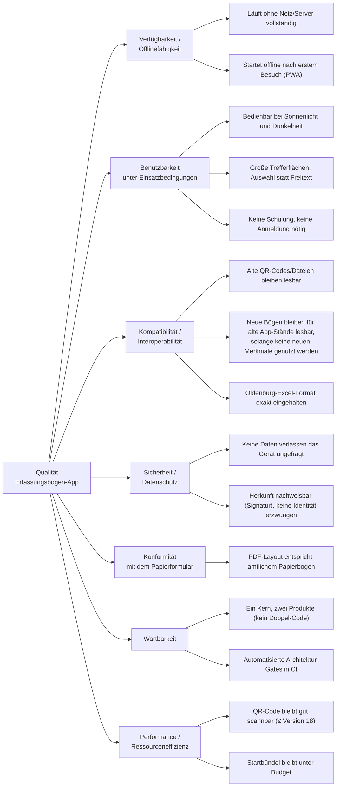

### 10.2 Qualitätsszenarien

| # | Qualitätsziel | Szenario | Bewertungsmaßstab / Nachweis im Repository |
| --- | --- | --- | --- |
| 1 | Offlinefähigkeit | Eine Einheit ruft die Web-App einmal online auf, verliert danach die Netzverbindung im Einsatzgebiet und füllt einen Bogen komplett aus, druckt PDF und erzeugt QR-Code. | Service Worker precacht App-Shell inkl. wasm/woff2 (`vite.config.ts`, VitePWA); Szenario „Die PDF entsteht auch ohne Netz und ohne Neuladen" in `features/uebergabe.feature`. |
| 2 | Benutzbarkeit im Feld | Ein Nutzer schaltet bei grellem Sonnenlicht in den Feld-Modus und kann alle Bedienelemente weiterhin klar erkennen. | `anzeige-modus.ts`, `features/daten-und-anzeige.feature` (Anzeigemodus Dunkel/Feld/Nacht, auch bei dunklem Systemdesign). |
| 3 | Schnellerfassung am Meldekopf | Eine fremde Einheit trifft ohne eigenen Bogen ein; der Meldekopf erfasst sie in wenigen Minuten (nur Stärke, Führungskraft, Fahrzeuge) und druckt einen Bogen. | `personalErfassung = NUR_STAERKE`, Minimalfelder laut `docs/datenmodell.md` („Meldekopf-Workflow"), gemessene Payload-Größe 191 Bytes → QR-Version 10. |
| 4 | Rückwärtskompatibilität | Ein vor Jahren gedruckter QR-Code (Schema-Version 2) wird mit der aktuellen App-Version gescannt und korrekt angezeigt. | Eingefrorene v2-Fixture in `codec.migration.test.ts` und `features/fixtures.ts`; `migriereBogen` deckt `2..SCHEMA_VERSION` ab. |
| 5 | Vorwärtskompatibilität | Ein mit der neuesten App erzeugter, aber „einfacher" Bogen (keine Übung, eine Fahrerlaubnisklasse je Person) wird von einer älteren App-Version noch gelesen. | `transportSchemaVersion()` wählt die kleinste tragende Schema-Version statt stets `SCHEMA_VERSION`. |
| 6 | Datenschutz | Ein Bogen wird offline per QR-Code weitergegeben; zu keinem Zeitpunkt wird ein Server kontaktiert oder ein Tracking-Cookie gesetzt. | CSP erlaubt nur `erfassungsbogen.goatcounter.com` als externen Host, keine Cookies (`vite.config.ts`); `PRODUCT.md` „Alles bleibt auf dem Gerät". |
| 7 | Herkunftsnachweis ohne PKI | Ein Meldekopf empfängt einen weitergereichten Bogen mit zwei Signaturstufen (Ersteller, Meldekopf) und sieht den vollständigen Meldeweg. | Signaturkette/Gegenzeichnen in `docs/datenmodell.md`; Anzeige „Meldeweg: Ursprung → Zwischenstelle → Absender". |
| 8 | Konformität mit Papierformat | Das gedruckte PDF eines THW-Bogens entspricht optisch dem amtlichen Papierbogen und lässt sich in bestehende (nicht-digitale) Meldewege einreihen. | `PRODUCT.md` Prinzip 3 „Das Papier ist der Vertrag"; `pdf-dokument.ts`. |
| 9 | Wartbarkeit über zwei Produkte | Eine Fehlerkorrektur im Codec wird im Kern-Repository committet und wirkt nach Aktualisierung des Submodul-Commits in beiden Produkten, ohne Codeduplikation. | Submodul-Architektur (`docs/entwicklung.md`), `npm run kern-kopien`-Gate verhindert Doppelkopien. |
| 10 | Bundle-Effizienz | Ein neuer Import eines großen Vokabular-Sammel-Moduls (statt modulgenau) wird im CI durch das Bundle-Budget erkannt und die Pipeline schlägt fehl. | `npm run bundle-budget` gegen `scripts/bundle-budget.json`, Gate in `ci.yml`. |
| 11 | QR-Scanbarkeit | Ein vollständig ausgefüllter THW-Bogen erzeugt einen QR-Code, der aus normaler Entfernung mit einer Handykamera in einem Zug scannbar ist. | Zielbudget ≤ QR-Version 18 (Fehlerkorrektur M); gemessen 511 Bytes → Version 18 unsigniert (`docs/datenmodell.md`). |
| 12 | Kein Datenverlust bei Fehlbedienung | Ein Nutzer löscht versehentlich eine Vorlage oder einen Sammlungseintrag und kann ihn aus dem Papierkorb wiederherstellen. | Prinzip „Nichts geht verloren" (`PRODUCT.md`); `papierkorb-ui.test.tsx`, `features/vorlagen.feature`, `features/einsatz-detail.feature`. |

### 10.3 Nicht formal festgelegte Qualitätsziele

Laut `PRODUCT.md` explizit noch nicht als bindende Zusage erklärt (Stand im
Dokument: 2026-08-06), obwohl faktisch etabliert und „bis auf Widerruf zu
bewahren": der Produktname „Erfassungsbogen"/erfassungsbogen.app, die
Amtlich-Optik über eigene Design-Token, die Schrift Archivo, die eingebackenen
taktischen Zeichen sowie der reine Schalter-Dunkelmodus. Ebenso ist kein
verbindlicher Barrierefreiheits-Standard (BITV/WCAG) festgelegt – nur
produktspezifisch umgesetzte Einzelmaßnahmen (Kontrast, Nacht-Modus).

---

## 11. Risiken und technische Schulden

Grundlage sind `docs/TODO.md`, die stillgelegten Teile der Release-Pipeline sowie
Beobachtungen aus der Code-/Teststruktur. Einschätzungen zu
Eintrittswahrscheinlichkeit/Auswirkung sind Interpretation der
Repository-Analyse, keine offiziellen Angaben des Projekts.

### 11.1 Offene Risiken (aus `docs/TODO.md`)

| Risiko | Beschreibung | Mögliche Auswirkung |
| --- | --- | --- |
| macOS-Distribution ausgesetzt | Der `build-mac`-Job ist per `if: false` deaktiviert, weil die Code-Signatur auf dem GitHub-Runner mit „security set-key-partition-list … process failed 1" scheitert (Stand 2026-09-05). | macOS-Nutzer haben aktuell keinen Desktop-Download, nur den Verweis auf die Web-App; ein wachsender Rückstand bei macOS-spezifischen Problemen ist möglich. |
| iOS-App noch nicht veröffentlicht | Kein App-Store-Eintrag, TestFlight „in Vorbereitung"; Geräte-/TestFlight-Tests sind offene To-dos. | iOS-Nutzer sind auf die Web-App angewiesen; native Fähigkeiten sind auf iOS ungetestet in Produktion. |
| Live-Kameratest ausstehend (Web/Electron) | Der Decodier-Roundtrip ist verifiziert (`npm run demo`), ein Live-Scan mit echter Kamera laut `docs/TODO.md` noch nicht. | Restrisiko, dass reale Kamerabedingungen (Beleuchtung, Fokus, Treiber) im Feld anders funktionieren als im Test. |
| Electron-Kamerazugriff (macOS, signiert) | `getUserMedia` benötigt im gehärteten, signierten Build `NSCameraUsageDescription` und das Hardened-Runtime-Entitlement für die Kamera; laut TODO noch zu verifizieren. | Ohne diese Einträge scheitert der QR-Scan in der signierten macOS-Desktop-App lautlos. |
| Android-Play-Signing-Wechsel | Wechselt das Projekt auf Google Play App Signing, signiert Google mit einem eigenen Schlüssel; der SHA-256-Fingerabdruck in `assetlinks.json` müsste ergänzt werden. | Ohne diesen Schritt bricht die Digital-Asset-Links-Verifikation und Deep Links gelten auf Android nicht mehr als „verified". |
| AASA-Content-Type über GitHub Pages | GitHub Pages liefert `apple-app-site-association` als `application/octet-stream` statt `application/json`; funktioniert nur, weil Apples CDN das akzeptiert (verifiziert 2026-07-12). | Ändert Apple diese Toleranz, brechen Universal Links ohne Codeänderung im Projekt. |
| Verzögerte Verifikation von Deep Links | Apple cached die AASA über sein CDN; nach einem Deploy kann die Verifikation bis zu 24 Stunden dauern. | Erschwert schnelles Debugging von Universal-Link-Problemen nach einem Release. |

### 11.2 Architektur- und Prozessrisiken

| Risiko | Beschreibung | Mögliche Auswirkung |
| --- | --- | --- |
| Externe Abhängigkeit von vier eigenständigen Kern-Repositories | Die vier `@bos/*`-Bausteine liegen in separaten GitHub-Repositories, als Submodule auf feste Commits gepinnt (ADR-003, Regel 6). | Ein Sicherheits- oder Korrektheits-Fix im Kern erreicht dieses Produkt erst, wenn jemand den Submodul-Commit bewusst aktualisiert; ohne festen Prozess können Fixes „liegen bleiben". Mitigiert durch die dokumentierte Exit-Strategie. |
| Koordinationsaufwand durch geteilten Kern | Änderungen am Kern betreffen S1-Control mit; sechs „Aufnahmeregeln" regeln, was in den Kern darf. | Ein für S1-Control sinnvoller Schnitt kann für den Erfassungsbogen suboptimal sein; Regel 1 kann Weiterentwicklung verzögern, bis der zweite Bedarf feststeht. |
| Peer-Dependency-„Diamant" bei `@bos/eeb-format` | `@bos/meldekopf` und `@bos/vokabulare` binden `@bos/eeb-format` als `peerDependency` ein – das konsumierende Produkt muss die eine gültige Kopie liefern. | Falsche Einbindung erzeugt zwei TypeScript-Typen gleichen Namens mit einer Fehlermeldung, „deren Ursache in keinem Stapelabzug steht" – ein bekanntes Stolperrisiko für neue Mitentwickler. |
| Kein `prepare`-Skript, manuelle Build-Reihenfolge | Die vier Kern-Pakete bauen ihr `dist/` nicht automatisch beim `npm install`. | Der Erfassungsbogen selbst ist unbetroffen (Vite bündelt die Quelle), aber S1-Control oder ein neuer Mitentwickler kann bei falscher Reihenfolge auf denselben CI-Fehler laufen (TS2307, 34 Folgefehler). |
| Übergangslösung bei den TypeScript-Werkzeugen der Kern-Submodule | Alle vier Kern-Pakete bauen/prüfen mit TypeScript 7 (`@typescript/native`), installieren aber zusätzlich `typescript-eslint` gegen eine TypeScript-6-Kompatibilitätsschicht. | Ausdrücklich als Übergang markiert; bis dahin ein zusätzlicher, undurchsichtiger Abhängigkeitspfad in allen vier Submodulen. |
| `@bos/vokabulare/berufe.ts` ohne dokumentierten Aktualisierungsweg | Die 3512 Berufsbezeichnungen liegen als statische, handgepflegte Tabelle vor – anders als die taktischen Zeichen gibt es keinen Update-Workflow. | Die Liste kann veralten, ohne dass ein technischer Mechanismus das bemerkt. |
| Lizenzhistorie der taktischen Zeichen | Die Zeichen stammen aus einer externen Sammlung (CC BY 4.0, © Jonas Köritz); das Upstream-Projekt merkt an, dass die Lizenz vor Februar 2021 anders war. | Bei Verwendung sehr alter, zwischengespeicherter Zeichenversionen bestünde ein Restrisiko unklarer Lizenzbedingungen. |
| Sehr große Einzeldateien | `app.tsx` (1788 Zeilen), `einsaetze-ui.tsx` (1352 Zeilen) sowie `einsaetze.ts` (752) und `codec.ts` (1043) in den Submodulen. | Höheres Risiko von Merge-Konflikten und höherer kognitiver Aufwand; kein Hinweis, dass weitere Modularisierung geplant ist. |
| Bus-Faktor / Ein-Personen-Projekt | Alle fünf Repositories nennen denselben einzelnen Autor/Maintainer; keine sichtbaren CODEOWNERS oder weiteren Committer-Hinweise. | Wartung, Sicherheitsreaktion und Weiterentwicklung hängen an einer Person – verschärft dadurch, dass auch S1-Control vom selben Kern abhängt. |
| TOFU-Vertrauensmodell ohne PKI | Bewusster Verzicht auf zentrale Zertifizierung bei den Ed25519-Signaturen. | Ein Schlüssel-Fingerabdruck bestätigt nur „derselbe Absender wie zuvor", nicht die reale Identität; Social-Engineering-Angriffe sind architektonisch nicht ausgeschlossen. |
| Native Gerätetests fehlen | Kamera-Scanner, Filesystem-Zugriff und Share-Sheet sind laut `docs/tests.md` „Ausbaustufe 3". | Regressionen in den plattformspezifischsten Pfaden werden nicht automatisch erkannt. |
| Offene Punkte im Datenmodell (Stufe 2) | `docs/datenmodell.md` nennt u. a. ein noch zu befüllendes THW-Ortsverbandsverzeichnis mit festzulegendem Aktualisierungsweg und ein noch nicht umgesetztes Deflate-Preset-Dictionary (zusätzliche 10–20 % Kompression). | Ohne Aktualisierungsweg veralten die eingebetteten Referenzdaten mit der Zeit. |
| CSP mit `'unsafe-inline'` — *seit `c7604e9` nur noch bei `style-src`* | `script-src` gibt die Inline-Blöcke seit 2026-09-12 einzeln per `sha256`-Hash frei; `style-src` behält `'unsafe-inline'`, weil React `style`-Attribute setzt. | Das Hauptrisiko (eingeschleustes Skript) ist abgefangen. Verbleibend: Style-Injection bleibt möglich, was in dieser App kein Datenabfluss, aber eine Darstellungsmanipulation sein kann. |

### 11.3 Technische Schulden (explizit im Code/Docs vermerkt)

- **Release-Aufräumung behält nur 10 Releases** (`KEEP: 10` in `release.yml`) –
  ältere Installer sind über GitHub Releases nicht mehr greifbar.
- **`docs/TODO.md`** führt mehrere unerledigte Punkte als Checkliste (Gerätetest
  iPhone, App-Store-Connect-Einrichtung, Live-Webcam-Test,
  Electron-Kamera-Entitlements, Play-Signing-Fingerabdruck-Nachtrag).
- **Vokabular-Tabellen** laut `docs/datenmodell.md`, Abschnitt „Offene Punkte für
  Stufe 2", noch auszuarbeiten – die Basisarchitektur steht, die inhaltliche
  Vollständigkeit je Organisation ist fortlaufender Pflegeaufwand.
- **Zwei TypeScript-Versionen nebeneinander** in allen vier Kern-Submodulen –
  Übergangslösung mit definiertem Wegfallkriterium.
- **`packages/kern-vendor/`-Rückweg ist vorbereitet, aber ungenutzt** – die
  Exit-Strategie ist eine Prozessvereinbarung, kein eingerichteter Mechanismus.

---

## 12. Glossar

### Fachbegriffe (BOS/Einsatzwesen)

| Begriff | Bedeutung |
| --- | --- |
| BOS | Behörden und Organisationen mit Sicherheitsaufgaben (THW, Feuerwehr, Polizei, Rettungsdienst, Hilfsorganisationen, Bundeswehr, Katastrophenschutz). |
| THW | Technisches Hilfswerk. |
| DRK / JUH / MHD / ASB | Deutsches Rotes Kreuz / Johanniter-Unfall-Hilfe / Malteser Hilfsdienst / Arbeiter-Samariter-Bund – Hilfsorganisationen. |
| DLRG | Deutsche Lebens-Rettungs-Gesellschaft. |
| Erfassungsbogen | Das (ursprünglich papierene) Formular, mit dem eine Einheit Stärke, Personal, Fahrzeuge und Sofortbedarf für einen Einsatz oder eine Übung dokumentiert. |
| Einheit | Die organisatorische Grundeinheit, die einen Erfassungsbogen führt (z. B. eine Fachgruppe, ein Löschzug, eine SEG). |
| Einsatz | Der konkrete Einsatz- bzw. Übungskontext (Zeitraum, Ort, Auftrag), unter dem Einheiten gemeldet werden. |
| Übung | Kennzeichnung eines Bogens als Übungs- statt echten Einsatzbogen (ab Schema-Version 6); wird in PDF/Anzeige deutlich markiert. |
| Meldekopf | Sammelstelle, die eintreffende (fremde) Einheiten erfasst bzw. deren Bögen aufnimmt und Stärke/Bedarf für die nächste Führungsstelle zusammenfasst. |
| Bereitstellungsraum | Ort, an dem Einheiten vor ihrem Einsatz gesammelt und für die Zuweisung vorgehalten werden. |
| Führungsstelle | Übergeordnete Leitungsebene, die Meldungen mehrerer Meldeköpfe/Einheiten empfängt und weiterverarbeitet. |
| Stärke | Personalstärkeangabe einer Einheit in der Schreibweise `x/y/z//g` (Führer/Unterführer/Mannschaft//Gesamt). |
| Sofortbedarf | Unmittelbarer Bedarf einer eintreffenden Einheit: Verpflegung, Betriebsstoff, Unterbringung, Ruhezeit. |
| StAN | Stärke- und Ausstattungsnachweisung – die organisationsseitig festgelegte Soll-Ausstattung einer Einheit. |
| Funkrufname | Standardisierte Sprechfunkbezeichnung eines Fahrzeugs/einer Einheit (z. B. „Heros Oldenburg 18/13"). |
| Taktisches Zeichen | Genormtes grafisches Symbol zur Kennzeichnung von Einheiten/Fahrzeugen/Einrichtungen im BOS-Umfeld. |
| Fachgruppe | THW-spezifische Bezeichnung einer spezialisierten Teileinheit (z. B. „FGr K (A)" – Fachgruppe Küche). |
| Ortsverband (OV) | Regionale Gliederungsebene, insbesondere beim THW; im Datenmodell über `standortRef` referenzierbar. |
| Kennzeichen | Amtliches oder organisationsinternes Fahrzeugkennzeichen (z. B. „THW-84397", „OL-FW 2041"). |

### Technische Begriffe (dieses Projekt)

| Begriff | Bedeutung |
| --- | --- |
| `EEB2` / `EEB2C` | Magic-Bytes/Format-Kennung des QR-Payloads: `EEB2` = unsignierter Bogen, `EEB2C` = signierter Container mit einer oder mehreren Signaturstufen. |
| Base41 | Eigenes, an Base45/RFC 9285 angelehntes, aber URL-sicheres 41-Zeichen-Alphabet zur Transportkodierung des QR-Dateninhalts (alphanumerischer QR-Modus). |
| Schema-Version | Versionsnummer des Datenmodells (aktuell 8); steuert, welche Felder ein Bogen enthalten kann und wie er migriert wird. |
| `transportSchemaVersion` | Funktion, die beim Kodieren die kleinste Schema-Version wählt, die den tatsächlichen Bogeninhalt noch verlustfrei trägt. |
| Segmentierung (`EEBS.`) | Aufteilung eines zu großen Bogens auf mehrere QR-Codes; jeder Teil trägt Teilnummer, Gesamtzahl und eine Prüfsumme. |
| Absenderkarte | Freiwillig hinterlegte Kontaktangabe (Name/E-Mail/Telefon) eines Geräts, die signiert mit jedem übergebenen Bogen mitreist. |
| Signaturkette / Gegenzeichnen | Mechanismus, bei dem ein unverändert weitergereichter Bogen um eine zusätzliche Signaturstufe ergänzt wird, statt neu signiert zu werden. |
| TOFU | Trust-On-First-Use – Vertrauensmodell ohne zentrale Zertifizierungsstelle. |
| Vokabular-Wert (`VokabularWert`) | Datentyp, der einen kontrollierten Wert entweder als 1-Byte-Code im Organisations-Namensraum oder als Freitext-Ausweg (`code 0` + String) trägt. |
| Namensraum (Organisationstyp) | 1-Byte-Enum, das festlegt, in welcher organisationsspezifischen Vokabular-Tabelle Codes aufgelöst werden. |
| `personalErfassung` | Enum `VOLLSTAENDIG` (jede Person einzeln erfasst) vs. `NUR_STAERKE` (Meldekopf-Schnellerfassung). |
| ADR | Architecture Decision Record – dokumentierte Architekturentscheidung. |
| S1-Control | Schwesterprodukt, das denselben UI-freien Kern nutzt. |
| Kern-Kopien-Prüfung (`kern-kopien`) | CI-Prüfschritt, der sicherstellt, dass jeder der vier Kern-Bausteine genau einmal im Abhängigkeitsbaum vorkommt. |
| Bundle-Budget | CI-Prüfschritt, der die Größe des gebauten Web-Bundles gegen `scripts/bundle-budget.json` prüft. |
| PWA | Progressive Web App – die unter erfassungsbogen.app gehostete, offlinefähige Web-App mit Service Worker. |
| Capacitor | Framework, das eine Web-App in eine native Android-/iOS-App-Hülle einbettet. |
| Electron | Framework, das eine Web-App als Desktop-Anwendung ausliefert. |
| Workbox / vite-plugin-pwa | Bibliothek bzw. Vite-Plugin zur Erzeugung des Service Workers samt Precache-Konfiguration. |
| GoatCounter | Cookielose, datensparsame Web-Analytics-Lösung, der einzige in der CSP erlaubte externe Host. |
| Oldenburg-Format | Nicht verhandelbares, festes Excel-Spaltenformat einer Führungsstelle (38 Spalten, feste Farben/Datumsformate). |
